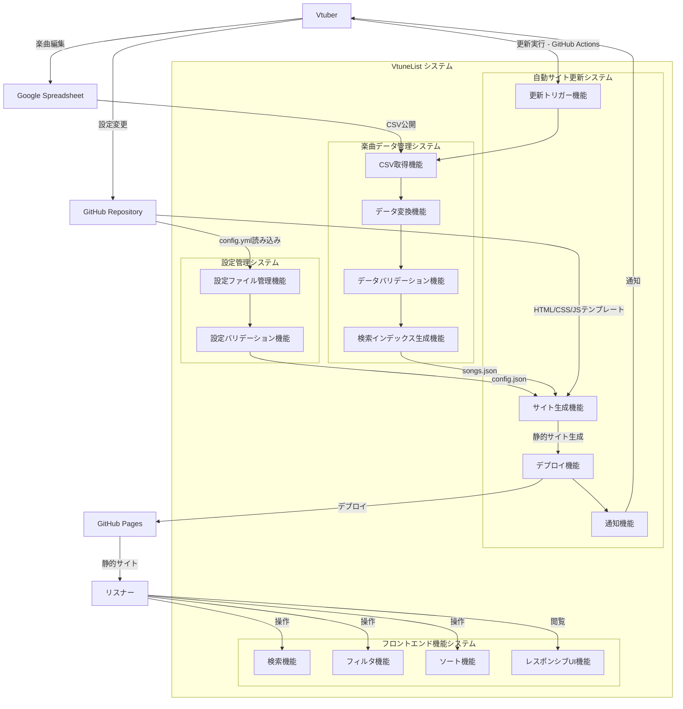
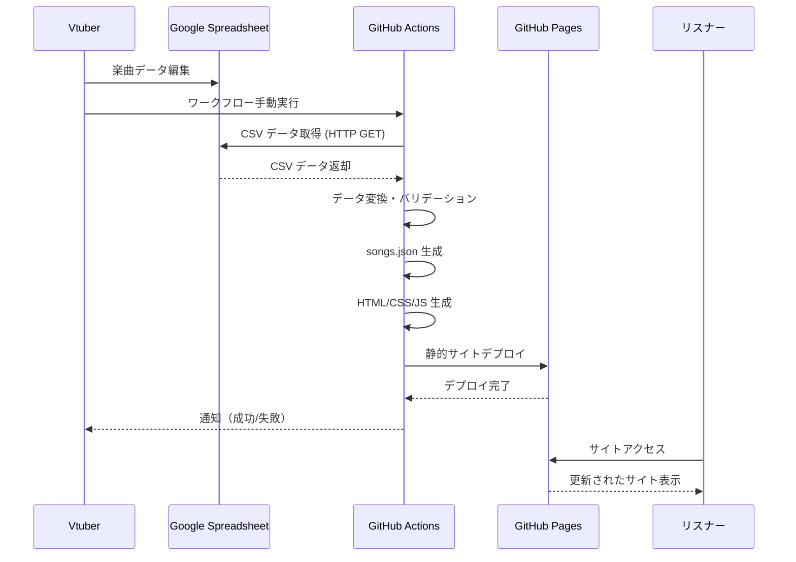
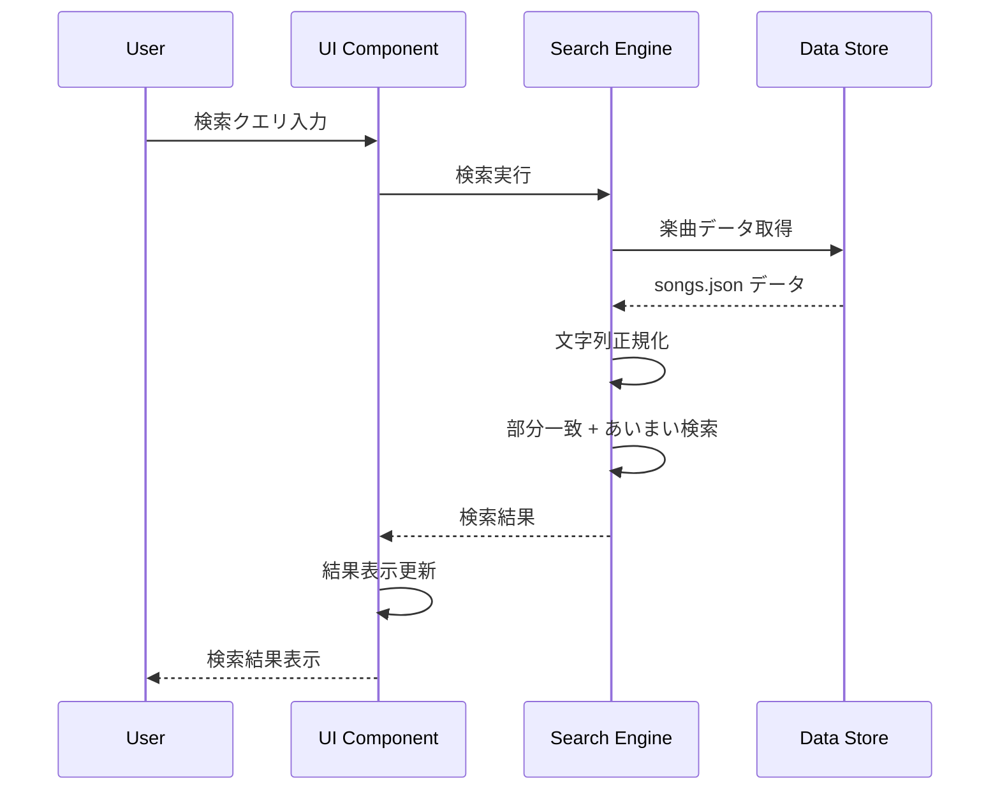

# VtuneList 機能仕様書

## 1. 概要

本ドキュメントでは、VtuneListシステムの各機能について技術的な詳細仕様を定義します。USER_STORIES.mdで定義されたユーザーストーリーを基に、実装レベルでの具体的な機能要件、API仕様、データフロー、エラーハンドリングを記述します。

## 2. システム概要図



## 3. 機能詳細仕様

### 3.1 楽曲データ管理システム

**機能ID**: F001  
**対応ユーザーストーリー**: US-002

**概要**: Google SpreadsheetからCSV形式でデータを取得し、楽曲情報を管理

**入力仕様**:
```
Spreadsheetシート構造:
| 楽曲名 | アーティスト | ジャンル | メモ |
| 文字列 | 文字列      | 文字列   | 文字列 |

制約:
- 楽曲名: 必須、最大200文字
- アーティスト: 必須、最大100文字  
- ジャンル: 任意、カンマ区切り、最大50文字
- メモ: 任意、最大500文字
```

**システム内機能の連携**:
1. **CSV取得機能**: HTTP GETリクエストでCSVデータを取得
2. **データ変換機能**: CSVパースでJavaScriptオブジェクトに変換  
3. **データバリデーション機能**: データバリデーション実行
4. **検索インデックス生成機能**: 検索インデックス（songs.json）生成


**処理フロー**:
1. 設定ファイル（config.yml）から各シートのCSV公開URLを取得
2. CSV取得
3. データ変換
4. データバリデーション
5. 検索インデックス生成

**中間出力(CSVパース後のJSON)仕様**:
```typescript
interface Song {
  title: string;          // 楽曲名
  artist: string;         // アーティスト名
  genre: string[];        // ジャンル配列
  note?: string;          // メモ（任意）
}

interface SongsData {
  songs: Song[];
  updated_at: string;     // ISO 8601形式
}
```

**最終出力仕様**
- クライアントサイド検索ライブラリ(staticseek)が生成する検索インデックス(JSON)

**エラーハンドリング**:
- CSV取得失敗: GitHub Actions失敗、詳細ログ出力
- パース失敗: 不正な文字エンコーディング、形式エラー
- バリデーション失敗: 必須項目欠如、文字数超過

---

### 3.2 自動サイト更新システム

**機能ID**: F002  
**対応ユーザーストーリー**: US-003

**概要**: GitHub Actionsによる楽曲データ更新とサイト再生成の自動化

**トリガー**:
- 手動実行（workflow_dispatch）
- スケジュール実行（任意、デフォルト無効）

**システム内機能の連携**:
1. **更新トリガー機能**: GitHub Actions workflow_dispatch受信
2. **サイト生成機能**: 楽曲データ + 設定データを統合し静的サイト生成
3. **デプロイ機能**: 生成されたサイトをGitHub Pagesにデプロイ
4. **通知機能**: 処理結果をVtuberに通知

**GitHub Actions ワークフロー仕様**:
```yaml
name: Update Song List
on:
  workflow_dispatch:
inputs:
  force_update:
    description: '強制更新フラグ'
    type: boolean
    default: false

jobs:
  update:
    runs-on: ubuntu-latest
    steps:
      - name: Checkout repository
      - name: Setup Node.js/Bun
      - name: Install dependencies
      - name: Fetch CSV data
      - name: Generate songs.json
      - name: Build static site
      - name: Deploy to GitHub Pages
      - name: Post notification
```

**処理時間要件**:
- 全体処理: 5分以内
- データ取得: 30秒以内
- サイト生成: 2分以内
- デプロイ: 2分以内

**通知機能**:
- 成功通知: GitHub通知（Actions完了）
- 失敗通知: 詳細エラーログ付きGitHub通知
- 通知内容: 処理時間、更新曲数、エラー詳細

---

### 3.3 フロントエンド機能システム

**機能ID**: F003-006  
**対応ユーザーストーリー**: US-004, US-005, US-006

**概要**: ユーザー向けのインタラクティブなWebインターフェース

**システム内機能の連携**:
1. **検索機能**: リアルタイム楽曲検索
2. **フィルタ機能**: ジャンル別フィルタリング  
3. **ソート機能**: 楽曲リストソート
4. **レスポンシブUI機能**: デバイス対応インターフェース

#### 検索機能詳細

**技術実装**:
- ライブラリ: staticseek
- 検索対象: title, artist, note, genre
- 検索方式: 部分一致 + あいまい検索

**検索仕様**:
- staticseekのインターフェイスに準拠
- 結果にはSong型のデータがkeyとして含まれる

**正規化処理(staticseek内でデフォルト実行)**:
- ひらがな⇔カタカナ変換
- 全角⇔半角変換
- 文字列トリム・スペース正規化

**パフォーマンス要件**:
- 検索応答時間: 0.02秒以内
- 対象データ量: 最大3000曲
- 同時検索処理: 制限なし（クライアントサイド）

**UI動作**:
- リアルタイム検索
- 検索結果カウント表示
- 検索履歴保存（localStorage、最大10件）

---

#### 3.2.2 ジャンルフィルタ機能

**機能ID**: F004  
**対応ユーザーストーリー**: US-005

**概要**: ジャンル別の楽曲フィルタリング機能

**フィルタ仕様**:
- staticseekのインターフェイスに準拠
- ジャンル指定をするクエリ文字列を組み立てて検索実行
  - keyword AND (from:genre genre1 OR from:genre genre2) 

**UI実装**:
- チェックボックス形式のジャンル選択
- 「すべて選択」「すべて解除」ボタン
- URLパラメータでフィルタ状態保存

**ジャンル管理**:
- 動的ジャンル一覧生成（サイト生成機能の中で全楽曲から抽出・これはサイト生成機能の仕様）
- ジャンル表示順序: アルファベット順
- ジャンル無し楽曲: "未分類" として扱い

---

#### 3.2.3 ソート機能

**機能ID**: F005  
**対応ユーザーストーリー**: 追加要件

**概要**: 楽曲リストのソート機能

**ソート項目**:
```typescript
type SortField = 'title' | 'artist' | 'category' | 'updated';
type SortOrder = 'asc' | 'desc';

interface SortOptions {
  field: SortField;
  order: SortOrder;
  locale: string;             // 'ja-JP'固定
}
```

**ソート仕様**:
- タイトル: 日本語文字列ソート
- アーティスト: 日本語文字列ソート
- カテゴリ: 文字列ソート
- デフォルト: タイトル昇順

**実装**: JavaScript Intl.Collator使用

---

#### 3.2.4 レスポンシブUI

**機能ID**: F006  
**対応ユーザーストーリー**: US-006

**概要**: デバイス対応のレスポンシブデザイン

**ブレイクポイント**:
```css
@media screen and (max-width: 768px) 
```

**画面構成**:

- 最初は実装せず単一カラムでモバイルもデスクトップも両方こなす
- コンテンツ幅は768px

**モバイル（～767px）**:
- 単一カラムレイアウト
- 検索ボックス: フルワイドス
- フィルタ: アコーディオン式
- 楽曲リスト: カード形式（縦積み）
- ナビゲーション: ハンバーガーメニュー

**デスクトップ（768px～）**:
- サイドバー + メインコンテンツ
- 検索ボックス: ヘッダー固定
- フィルタ: サイドバー常設
- 楽曲リスト: テーブル形式

**パフォーマンス**:
- 初回読み込み: 3秒以内
- ページ遷移: 1秒以内
- 画像遅延読み込み: 実装

---

### 3.4 設定管理システム

**機能ID**: F007  
**対応ユーザーストーリー**: US-001

**概要**: サイト設定の管理機能

**システム内機能の連携**:
1. **設定ファイル管理機能**: config.yml読み込み・解析
2. **設定バリデーション機能**: 設定値の検証・エラーチェック

**設定ファイル仕様** (config.yml):
```yaml
# サイト基本設定
site:
  title: "楽曲リスト"               # サイトタイトル
  description: "歌枠用楽曲リスト"    # サイト説明
  author: "Vtuber名"               # 作成者
  theme: "light"                   # テーマ (light/dark/auto)
  language: "ja"                   # 言語

# データソース設定  
data:
  sheets:
    - url: "CSV公開URL"           # CSV公開URL
    - url: "CSV公開URL2" 

# 機能設定(現状実装なし)
features:

# UI設定(現状実装なし)
ui:
```

**バリデーション**:
- YAML形式チェック
- 必須項目検証
- URL形式検証
- 文字数制限チェック

---

### 3.5 エラーハンドリングシステム

#### フロントエンドエラー処理機能

**機能ID**: F008  
**対応ユーザーストーリー**: US-007

**エラー分類**:
```typescript
enum ErrorType {
  NETWORK_ERROR = 'network_error',           // songs.json読み込みエラー
  DATA_PARSE_ERROR = 'data_parse_error',     // マルフォームなsongs.json
  SEARCH_ERROR = 'search_error',             // staticseek実行エラー
  RUNTIME_ERROR = 'runtime_error',           // JavaScript実行時例外
  STORAGE_ERROR = 'storage_error',           // localStorage操作エラー
  DOM_ERROR = 'dom_error'                    // DOM初期化失敗
}

interface VtuneListError {
  type: ErrorType;
  message: string;        // ユーザー向けメッセージ（日本語）
  details: string;        // 技術的詳細
  timestamp: string;      // エラー発生時刻
  recoverable: boolean;   // 回復可能かどうか
  severity: 'critical' | 'warning' | 'info'; // 深刻度
}
```

**エラー別の表示・対応方法**:

| エラータイプ | 深刻度 | 表示方法 | ユーザーメッセージ | 対応アクション |
|------------|-------|---------|------------------|--------------|
| NETWORK_ERROR | critical | エラーページ | 「楽曲データを読み込めません」 | 再読み込みボタン + お問い合わせリンク |
| DATA_PARSE_ERROR | critical | エラーページ | 「楽曲データが破損しています」 | 管理者への連絡案内 |
| SEARCH_ERROR | warning | 警告バナー | 「検索機能が利用できません」 | 全件表示への切り替え + 機能無効化 |
| RUNTIME_ERROR | warning | トースト通知 | 「予期しないエラーが発生しました」 | 詳細をConsoleに出力 + 継続可能 |
| STORAGE_ERROR | info | トースト通知 | 「設定の保存ができません」 | 機能継続（メモリ上で動作） |
| DOM_ERROR | critical | エラーページ | 「サイトの初期化に失敗しました」 | ブラウザ更新案内 |

**ログ管理**:
- ブラウザConsole出力（全エラー）
- 統計情報送信なし（プライバシー配慮）

---

#### バックエンドエラー処理機能

**機能ID**: F009  
**対応ユーザーストーリー**: US-007

**エラー分類**:
```typescript
enum BackendErrorType {
  CSV_NETWORK_ERROR = 'csv_network_error',         // CSV取得ネットワークエラー
  CSV_FORMAT_ERROR = 'csv_format_error',           // CSV形式異常エラー
  CONFIG_FORMAT_ERROR = 'config_format_error',     // config.yml形式エラー
  SSG_FAILURE = 'ssg_failure',                     // 静的サイト生成失敗
  DEPENDENCY_ERROR = 'dependency_error',           // 依存関係インストール失敗
  ENVIRONMENT_ERROR = 'environment_error',         // 環境セットアップ失敗
  DEPLOY_ERROR = 'deploy_error',                   // GitHub Pagesデプロイ失敗
  PERMISSION_ERROR = 'permission_error',           // 権限エラー
  QUOTA_ERROR = 'quota_error',                     // GitHub Actions使用量上限
  TIMEOUT_ERROR = 'timeout_error'                  // 処理時間制限超過
}
```

**エラー別の表示・対応方法**:

| エラータイプ | 深刻度 | 表示方法 | ユーザーメッセージ | 対応アクション |
|------------|-------|---------|------------------|--------------|
| CSV_NETWORK_ERROR | critical | GitHub通知 | 「楽曲データの取得に失敗しました」 | CSV公開URL確認案内 + 再実行 |
| CSV_FORMAT_ERROR | critical | GitHub通知 | 「楽曲データの形式が正しくありません」 | Spreadsheet形式確認案内 |
| CONFIG_FORMAT_ERROR | critical | GitHub通知 | 「設定ファイルの形式が正しくありません」 | config.yml修正案内 |
| SSG_FAILURE | critical | GitHub通知 | 「サイト生成に失敗しました」 | ログ確認案内 + 再実行 |
| DEPENDENCY_ERROR | warning | GitHub通知 | 「依存関係のインストールに失敗しました」 | package.json確認案内 |
| ENVIRONMENT_ERROR | critical | GitHub通知 | 「実行環境の準備に失敗しました」 | GitHub Actions設定確認案内 |
| DEPLOY_ERROR | critical | GitHub通知 | 「サイトの公開に失敗しました」 | GitHub Pages設定確認案内 |
| PERMISSION_ERROR | critical | GitHub通知 | 「権限が不足しています」 | リポジトリ・Pages権限確認案内 |
| QUOTA_ERROR | warning | GitHub通知 | 「GitHub Actions使用量を超過しました」 | 使用量確認 + 翌月待機案内 |
| TIMEOUT_ERROR | warning | GitHub通知 | 「処理時間が制限を超過しました」 | データ量確認 + 分割処理案内 |

**GitHub Actions エラー処理実装**:
```yaml
# 各ステップでのエラーハンドリング
- name: Handle Step Failure
  if: failure()
  run: |
    echo "::error::ステップ失敗: ${{ env.ERROR_TYPE }}"
    echo "::set-output name=error_details::${{ env.ERROR_MESSAGE }}"
    
# 統一通知処理  
- name: Notify Failure
  if: failure()
  uses: actions/github-script@v6
  with:
    script: |
      const errorMessages = {
        'csv_network_error': 'CSV公開URLを確認してください',
        'csv_format_error': 'Spreadsheetの形式を確認してください',
        'config_format_error': 'config.ymlの形式を確認してください',
        // ... 他のエラータイプ
      };
      
      github.rest.issues.create({
        title: `楽曲リスト更新エラー (${process.env.ERROR_TYPE})`,
        body: `${errorMessages[process.env.ERROR_TYPE]}\n\n詳細ログ:\n\`\`\`\n${{ steps.error.outputs.error_details }}\n\`\`\``
      });
```

**通知・ログ管理**:
- **GitHub Issues**: エラー詳細の自動Issue作成
- **GitHub通知**: Actions完了通知（失敗時）
- **ワークフローログ**: 詳細なエラー情報記録
- **再実行**: 一時的エラーに対する手動再実行サポート

---

## 4. データフロー詳細

### 4.1 データ更新フロー



### 4.2 検索処理フロー



## 5. セキュリティ仕様

### 5.1 データ保護

- **個人情報**: 楽曲データに個人情報を含まない設計
- **認証**: 管理画面なし（GitHub認証のみ）
- **HTTPS**: GitHub Pages強制HTTPS
- **XSS対策**: ユーザー入力のエスケープ処理

### 5.2 アクセス制御

- **読み取り**: パブリックアクセス（制限なし）
- **書き込み**: GitHubリポジトリオーナーのみ
- **CSV URL**: 公開URL使用（アクセス制限なし）

## 6. パフォーマンス要件

### 6.1 応答時間

| 操作 | 目標時間 | 最大時間 |
|------|---------|---------|
| 初回ページロード | 2秒 | 3秒 |
| 検索結果表示 | 0.02秒 | 0.05秒 |
| フィルタ適用 | 0.1秒 | 0.2秒 |
| ソート実行 | 0.1秒 | 0.2秒 |

### 6.2 データ容量

| 項目 | 想定値 | 上限値 |
|------|--------|--------|
| 楽曲データ(JSON) | 300KB | 1MB |
| CSS/JS | 200KB | 500KB |
| フォント | 100KB | 200KB |
| 画像 | 50KB | 100KB |

### 6.3 同時接続

- **想定同時接続数**: 100人
- **ピーク接続数**: 500人
- **対応**: GitHub Pages CDNによる負荷分散

## 7. ブラウザ対応

### 7.1 対応ブラウザ

| ブラウザ | バージョン | 対応レベル |
|----------|------------|------------|
| Chrome (Desktop) | TBD（実装時決定） | フル対応 |
| Android Chrome | TBD（実装時決定） | フル対応 |

**方針**:
- HTML/CSS設計を簡略化し、必要な機能に応じてバージョンを決定
- 検証可能な環境に限定してしっかりとした品質を確保

### 7.2 フォールバック

- **JavaScript無効**: 基本表示のみ（検索・フィルタ無効）

## 8. テスト仕様 [暫定]

### 8.1 単体テスト

- **検索機能**: クエリ処理、正規化、あいまい検索
- **フィルタ機能**: 条件処理、複数選択
- **ソート機能**: 文字列ソート、日本語対応
- **データ変換**: CSV→JSON変換、バリデーション

### 8.2 統合テスト

- **データフロー**: CSV取得→変換→表示
- **GitHub Actions**: ワークフロー実行→デプロイ
- **エラー処理**: エラー発生→通知→回復

### 8.3 E2Eテスト（Playwright）

```typescript
test('楽曲検索機能', async ({ page }) => {
  await page.goto('/');
  await page.fill('[data-testid=search-input]', '残酷');
  await page.waitForTimeout(300); // デバウンス待機
  
  const results = await page.locator('[data-testid=song-item]');
  await expect(results.first()).toContainText('残酷な天使のテーゼ');
  
  const searchTime = await page.textContent('[data-testid=search-time]');
  expect(parseFloat(searchTime)).toBeLessThan(0.05);
});
```

## 9. 運用・監視 [暫定]

**注意**: GitHub Pages（静的ホスティング）では従来的なサーバーログアクセスは不可能。監視手法は限定的。

### 9.1 ログ出力

**GitHub Actions ログ**:
- データ取得時間
- 変換処理時間  
- エラー詳細
- 更新楽曲数

**フロントエンド ログ**:
- 検索パフォーマンス（ブラウザConsole）
- エラー発生状況（ブラウザConsole）
- ユーザー操作統計（匿名、localStorage）

### 9.2 監視項目（制約あり）

- **サイト可用性**: 外部監視サービス利用（UptimeRobot等）
- **データ更新**: GitHub Actions実行履歴確認
- **パフォーマンス**: Google Search Console、手動測定
- **エラー率**: 外部エラー収集サービス利用（Sentry等、要検討）

これらの機能仕様に基づいて、次のフェーズでアーキテクチャ設計とUI/UX設計を進めていきます。