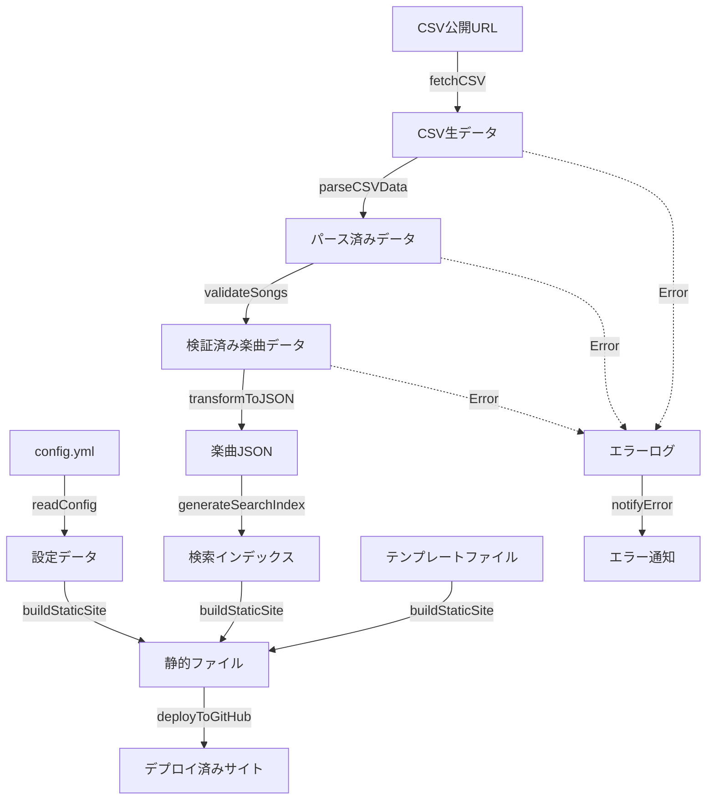

# VtuneList ビルド・デプロイ実装仕様書

## 1. 技術スタック

### 1.1 データ処理・ビルド環境
- **JavaScript ランタイム**: Bun
- **CSV パース**: Papa Parse
- **エラーハンドリング**: NeverThrow (Result型)
- **YAML パース**: js-yaml
- **静的サイト生成**: Vite + custom scripts
- **CI/CD**: GitHub Actions

### 1.2 依存関係
```json
{
  "dependencies": {
    "papaparse": "^5.4.1",
    "neverthrow": "^6.1.0",
    "js-yaml": "^4.1.0",
    "vite": "^5.0.0"
  },
  "devDependencies": {
    "@types/papaparse": "^5.3.14",
    "@types/js-yaml": "^4.0.9",
    "typescript": "^5.0.0",
    "vitest": "^1.0.0"
  }
}
```

## 2. 概要

VtuneListのデータ処理・サイト生成・デプロイに関する実装仕様を関数型プログラミング手法で定義します。CSV取得からGitHub Pagesデプロイまでの全プロセスを、純粋関数と副作用関数を分離した設計で実装します。

## 3. アーキテクチャ原則

### 3.1 関数型設計原則
- **不変性**: 全てのデータは不変（Immutable）
- **純粋関数**: 副作用のないデータ変換関数
- **関数合成**: 小さな関数を組み合わせて複雑な処理を構築
- **明示的な副作用**: I/O操作を明確に分離

### 3.2 エラーハンドリング戦略
```typescript
import { Result, ok, err } from 'neverthrow';

// NeverThrow Result型を全体で使用
type VtuneResult<T> = Result<T, VtuneListError>;
```

## 4. システムデータフロー

### 4.1 全体データフロー図



### 4.2 関数パイプライン設計

**メインビルドパイプライン**
```typescript
/**
 * VtuneListの完全ビルドパイプラインを実行
 * @param configPath - 設定ファイル（config.yml）のパス
 * @param templateDir - HTMLテンプレートディレクトリのパス
 * @returns デプロイ結果を含むResult型
 */
function buildVtuneList(
  configPath: string, 
  templateDir: string
): Promise<VtuneResult<DeploymentResult>>
```

**処理フロー**:
1. 設定ファイル読み込み（readConfig）
2. CSV データ取得（fetchAllCSVData）
3. CSV パース（parseCSVData）
4. データ検証（validateSongs）
5. JSON 変換（transformToJSON）
6. テンプレート読み込み（loadTemplates）
7. 静的サイト生成（buildStaticSite）
8. GitHub Pages デプロイ（deployToGitHub）

**実装方針**: NeverThrow の `ResultAsync.andThen()` を使用した関数合成により、エラーハンドリングを一元化

## 5. データ型定義

### 5.1 コアデータ型

```typescript
// 楽曲データ
interface Song {
  readonly title: string;
  readonly artist: string;
  readonly genres: readonly string[];
  readonly note?: string;
}

// 楽曲データセット
interface SongsData {
  readonly songs: readonly Song[];
  readonly metadata: SongsMetadata;
}

interface SongsMetadata {
  readonly updatedAt: string; // ISO 8601
  readonly totalCount: number;
  readonly genreCount: Record<string, number>;
}

// 設定データ
interface VtuneListConfig {
  readonly site: SiteConfig;
  readonly data: DataConfig;
}

interface SiteConfig {
  readonly title: string;
  readonly description: string;
  readonly author: string;
  readonly theme: 'light' | 'dark' | 'auto';
  readonly language: string;
}

interface DataConfig {
  readonly sheets: readonly SheetConfig[];
}

interface SheetConfig {
  readonly url: string;
  readonly name?: string;
}
```

### 5.2 処理結果データ型

```typescript
// 静的サイトファイル
interface StaticFiles {
  readonly files: readonly GeneratedFile[];
  readonly distDir: string;
}

interface GeneratedFile {
  readonly path: string;
  readonly content: string;
}

// テンプレートファイル
interface TemplateFiles {
  readonly html: string;
  readonly css: string;
  readonly js: string;
}

// デプロイメント結果
interface DeploymentResult {
  readonly deployedAt: string;
  readonly fileCount: number;
  readonly status: 'success' | 'failed';
}
```

### 5.3 エラー型

```typescript
enum VtuneListErrorType {
  CONFIG_ERROR = 'CONFIG_ERROR',
  NETWORK_ERROR = 'NETWORK_ERROR',
  PARSE_ERROR = 'PARSE_ERROR',
  VALIDATION_ERROR = 'VALIDATION_ERROR',
  BUILD_ERROR = 'BUILD_ERROR',
  DEPLOY_ERROR = 'DEPLOY_ERROR'
}

interface VtuneListError {
  readonly type: VtuneListErrorType;
  readonly message: string;
  readonly details?: unknown;
  readonly timestamp: string;
}
```

## 6. 純粋関数仕様

### 6.1 データ変換関数

```typescript
/**
 * CSV文字列をパースして構造化データに変換
 * @param csvText - CSV形式の文字列データ
 * @returns パース済みのCSVデータまたはエラー
 */
function parseCSVData(csvText: string): VtuneResult<readonly Song[]>
```

**処理内容**: Papa Parse ライブラリを使用してCSVを解析。ヘッダー行を含む形式で処理し、空行をスキップ。各フィールドの前後空白をトリムする。

```typescript
/**
 * パース済みCSVデータから楽曲データに変換・検証
 * @param songs - パース済み楽曲データ
 * @returns 検証済み楽曲データまたはエラー
 */
function validateSongs(songs: readonly Song[]): VtuneResult<readonly Song[]>
```

**処理内容**: 楽曲データの検証を実施
- タイトル・アーティスト名の必須チェック
- 文字数制限チェック（タイトル200文字、アーティスト100文字）
- ジャンル文字列の正規化（カンマ区切り → 配列）
- 不正なデータはエラーとして記録し、有効なデータのみ抽出

```typescript
/**
 * 楽曲データ配列をメタデータ付きJSON形式に変換
 * @param songs - 検証済み楽曲データ配列
 * @returns メタデータ付き楽曲データセット
 */
function transformToJSON(songs: readonly Song[]): VtuneResult<SongsData>
```

**処理内容**: 楽曲配列からメタデータを生成
- 更新時刻（ISO 8601形式）
- 総楽曲数
- ジャンル別楽曲数の統計
- 最終的なJSONデータ構造の構築

## 7. 副作用関数仕様

### 7.1 I/O操作関数

```typescript
/**
 * YAML設定ファイルを読み込みバリデーション
 * @param configPath - 設定ファイルのパス
 * @returns 設定データまたはエラー
 */
function readConfig(configPath: string): Promise<VtuneResult<VtuneListConfig>>
```

**処理内容**: ファイルシステムからYAMLファイルを読み込み、js-yamlでパース。設定データの必須項目チェックとスキーマ検証を実施。

```typescript
/**
 * 単一のCSV公開URLからデータを取得
 * @param url - CSV公開URL
 * @returns CSV文字列データまたはエラー
 */
function fetchCSVData(url: string): Promise<VtuneResult<string>>
```

**処理内容**: HTTP GETリクエストでCSVデータを取得。30秒タイムアウト設定、Accept: text/csvヘッダー送信。HTTPステータスエラーとネットワークエラーを区別して処理。

```typescript
/**
 * 複数のCSV URLから並行データ取得
 * @param sheets - CSVシート設定配列
 * @returns 結合済みCSVデータまたはエラー
 */
function fetchAllCSVData(sheets: readonly SheetConfig[]): Promise<VtuneResult<string>>
```

**処理内容**: Promise.allSettledで複数URLから並行取得。取得成功したCSVデータを結合し、1つ以上のエラーがある場合は最初のエラーを返す。

### 7.2 ファイル生成・デプロイ関数

```typescript
/**
 * テンプレートファイルの読み込み
 * @param templateDir - テンプレートディレクトリパス
 * @returns HTMLテンプレートファイル群またはエラー
 */
function loadTemplates(templateDir: string): Promise<VtuneResult<TemplateFiles>>
```

**処理内容**: 指定ディレクトリからHTML、CSS、JavaScriptテンプレートファイルを読み込む。

```typescript
/**
 * 楽曲データとテンプレートから静的サイトを生成
 * @param songsData - 楽曲データセット
 * @param templates - テンプレートファイル群
 * @param config - サイト設定
 * @returns 生成された静的ファイル群またはエラー
 */
function buildStaticSite(
  songsData: SongsData, 
  templates: TemplateFiles, 
  config: VtuneListConfig
): Promise<VtuneResult<StaticFiles>>
```

**処理内容**: distディレクトリを作成し、以下のファイルを生成
- songs.json: 楽曲データのJSON出力
- index.html: テンプレートに設定値を挿入
- CSS・JavaScriptファイル: テンプレートからコピー

```typescript
/**
 * GitHub Pages へのデプロイ実行
 * @param staticFiles - 生成済み静的ファイル群
 * @returns デプロイ結果またはエラー
 */
function deployToGitHub(staticFiles: StaticFiles): Promise<VtuneResult<DeploymentResult>>
```

**処理内容**: GitHub Actions環境での自動デプロイを想定。実際のgitコマンド実行やPages設定はワークフロー側で処理。

## 8. エラーハンドリング戦略

### 8.1 リトライ機能付きHTTP取得

```typescript
/**
 * 指数バックオフ付きリトライ機能でCSVデータを取得
 * @param url - CSV公開URL
 * @param maxRetries - 最大リトライ回数（デフォルト: 3回）
 * @returns CSVデータまたは最終エラー
 */
function fetchWithRetry(url: string, maxRetries?: number): Promise<VtuneResult<string>>
```

**処理内容**: ネットワークエラーやタイムアウト時の自動リトライ機能。指数バックオフ（1秒 → 2秒 → 4秒）で再試行間隔を調整。最大リトライ回数に達したら最後のエラーを返す。

### 8.2 設定バリデーション

```typescript
/**
 * YAML設定データの構造とスキーマを検証
 * @param configData - パース済みYAMLデータ
 * @returns 検証済み設定データまたはエラー
 */
function validateConfig(configData: unknown): VtuneResult<VtuneListConfig>
```

**処理内容**: 設定データの必須項目チェック
- site.title の存在確認
- data.sheets が配列であること
- 各sheet設定にURL が含まれること
- その他の設定値の型チェック


## 9. デプロイメント仕様

### 9.1 GitHub Actions ワークフロー

**トリガー**: 手動実行（workflow_dispatch）
**実行環境**: ubuntu-latest
**主要ステップ**:
1. リポジトリチェックアウト
2. Bun 環境セットアップ
3. 依存関係インストール
4. ビルド実行（buildVtuneList 関数）
5. GitHub Pages デプロイ（dist ディレクトリ）
6. 失敗時のエラー通知（GitHub Issue 作成）

### 9.2 ビルドスクリプト仕様

**エントリポイント**: `scripts/build.ts`
**処理内容**: 
- buildVtuneList 関数を実行
- 成功時はファイル数と楽曲数を出力
- 失敗時はエラー詳細を出力して終了コード1で終了