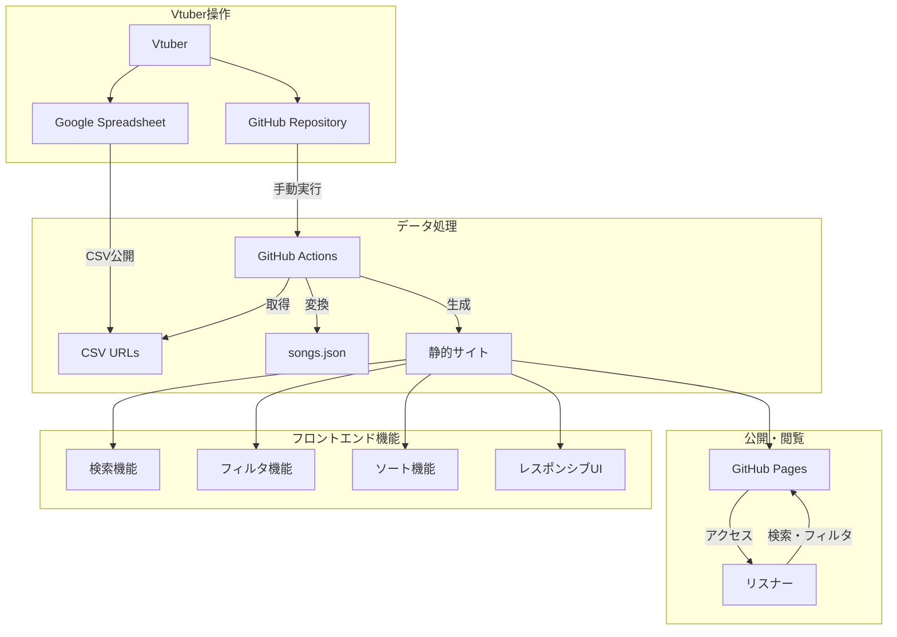
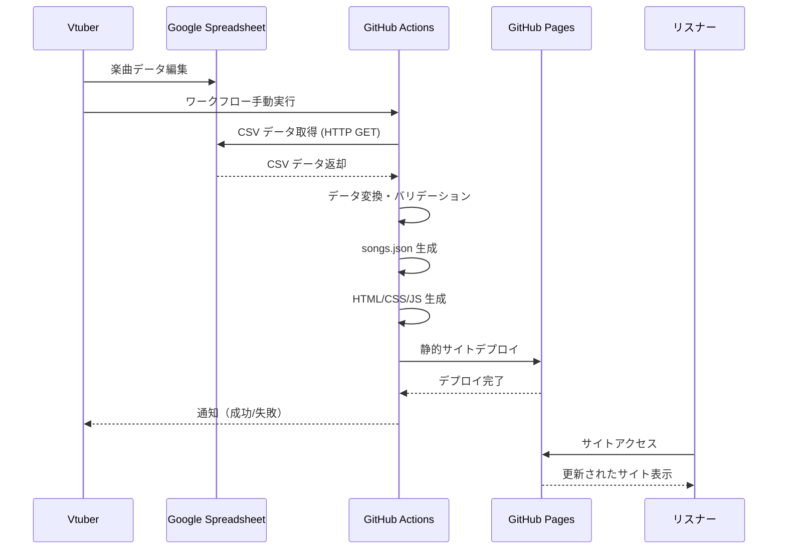
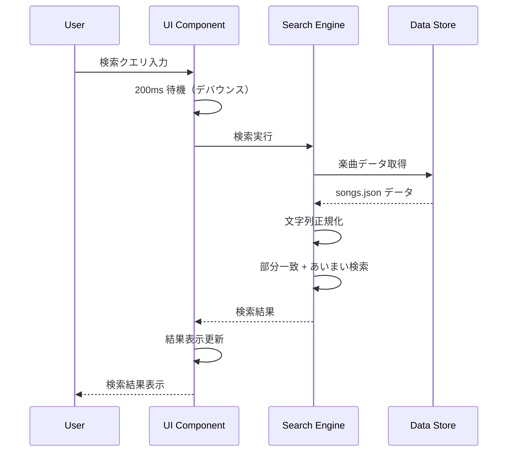

# VtuneList 機能仕様書

## 1. 概要

本ドキュメントでは、VtuneListシステムの各機能について技術的な詳細仕様を定義します。USER_STORIES.mdで定義されたユーザーストーリーを基に、実装レベルでの具体的な機能要件、API仕様、データフロー、エラーハンドリングを記述します。

## 2. システム概要図



## 3. 機能詳細仕様

### 3.1 楽曲データ管理システム

#### 3.1.1 Spreadsheet連携機能

**機能ID**: F001  
**対応ユーザーストーリー**: US-002

**概要**: Google SpreadsheetからCSV形式でデータを取得し、楽曲情報を管理

**入力仕様**:
```
Spreadsheetシート構造:
| 楽曲名 | アーティスト | ジャンル | メモ |
| 文字列 | 文字列      | 文字列   | 文字列 |

制約:
- 楽曲名: 必須、最大200文字
- アーティスト: 必須、最大100文字  
- ジャンル: 任意、カンマ区切り、最大50文字
- メモ: 任意、最大500文字
```

**処理フロー**:
1. 設定ファイル（config.yml）から各シートのCSV公開URLを取得
2. HTTP GETリクエストでCSVデータを取得
3. CSVパースでJavaScriptオブジェクトに変換
4. データバリデーション実行
5. 統合JSONファイル（songs.json）生成

**出力仕様**:
```typescript
interface Song {
  title: string;          // 楽曲名
  artist: string;         // アーティスト名
  genre: string[];        // ジャンル配列
  note?: string;          // メモ（任意）
  category: string;       // 元シート名
}

interface SongsData {
  songs: Song[];
  categories: string[];
  updated_at: string;     // ISO 8601形式
  total_count: number;
}
```

**エラーハンドリング**:
- CSV取得失敗: GitHub Actions失敗、詳細ログ出力
- パース失敗: 不正な文字エンコーディング、形式エラー
- バリデーション失敗: 必須項目欠如、文字数超過

---

#### 3.1.2 自動サイト更新機能

**機能ID**: F002  
**対応ユーザーストーリー**: US-003

**概要**: GitHub Actionsによる楽曲データ更新とサイト再生成の自動化

**トリガー**:
- 手動実行（workflow_dispatch）
- スケジュール実行（任意、デフォルト無効）

**GitHub Actions ワークフロー仕様**:
```yaml
name: Update Song List
on:
  workflow_dispatch:
inputs:
  force_update:
    description: '強制更新フラグ'
    type: boolean
    default: false

jobs:
  update:
    runs-on: ubuntu-latest
    steps:
      - name: データ取得・変換
      - name: サイト生成
      - name: デプロイ
      - name: 通知
```

**処理時間要件**:
- 全体処理: 5分以内
- データ取得: 30秒以内
- サイト生成: 2分以内
- デプロイ: 2分以内

**通知機能**:
- 成功通知: GitHub通知（Actions完了）
- 失敗通知: 詳細エラーログ付きGitHub通知
- 通知内容: 処理時間、更新曲数、エラー詳細

---

### 3.2 フロントエンド機能

#### 3.2.1 楽曲検索機能

**機能ID**: F003  
**対応ユーザーストーリー**: US-004

**概要**: リアルタイムな楽曲検索機能

**技術実装**:
- ライブラリ: staticseek
- 検索対象: title, artist, note, genre
- 検索方式: 部分一致 + あいまい検索

**検索仕様**:
```typescript
interface SearchOptions {
  query: string;              // 検索クエリ
  fields: string[];           // 検索対象フィールド
  fuzzy: boolean;             // あいまい検索有効化
  caseSensitive: boolean;     // 大文字小文字区別（false固定）
  normalize: boolean;         // 文字正規化有効（true固定）
}

interface SearchResult {
  songs: Song[];              // マッチした楽曲
  total_count: number;        // 総件数
  search_time: number;        // 検索時間（ms）
  query_processed: string;    // 正規化後クエリ
}
```

**正規化処理**:
- ひらがな⇔カタカナ変換
- 全角⇔半角変換
- 文字列トリム・スペース正規化

**パフォーマンス要件**:
- 検索応答時間: 0.02秒以内
- 対象データ量: 最大3000曲
- 同時検索処理: 制限なし（クライアントサイド）

**UI動作**:
- リアルタイム検索（入力200ms後に実行）
- 検索中インディケータ表示
- 検索結果カウント表示
- 検索履歴保存（localStorage、最大10件）

---

#### 3.2.2 ジャンルフィルタ機能

**機能ID**: F004  
**対応ユーザーストーリー**: US-005

**概要**: ジャンル別の楽曲フィルタリング機能

**フィルタ仕様**:
```typescript
interface FilterOptions {
  selectedGenres: string[];   // 選択ジャンル
  includeUntagged: boolean;   // ジャンル未指定を含む
  filterMode: 'OR' | 'AND';   // フィルタ条件（OR固定）
}

interface FilterResult {
  filteredSongs: Song[];
  availableGenres: string[];  // 利用可能ジャンル
  appliedFilters: string[];   // 適用フィルタ
}
```

**UI実装**:
- チェックボックス形式のジャンル選択
- 「すべて選択」「すべて解除」ボタン
- 選択中ジャンルのカウント表示
- URLパラメータでフィルタ状態保存

**ジャンル管理**:
- 動的ジャンル一覧生成（全楽曲から抽出）
- ジャンル表示順序: アルファベット順
- ジャンル無し楽曲: "未分類" として扱い

---

#### 3.2.3 ソート機能

**機能ID**: F005  
**対応ユーザーストーリー**: 追加要件

**概要**: 楽曲リストのソート機能

**ソート項目**:
```typescript
type SortField = 'title' | 'artist' | 'category' | 'updated';
type SortOrder = 'asc' | 'desc';

interface SortOptions {
  field: SortField;
  order: SortOrder;
  locale: string;             // 'ja-JP'固定
}
```

**ソート仕様**:
- タイトル: 日本語文字列ソート
- アーティスト: 日本語文字列ソート
- カテゴリ: 文字列ソート
- デフォルト: タイトル昇順

**実装**: JavaScript Intl.Collator使用

---

#### 3.2.4 レスポンシブUI

**機能ID**: F006  
**対応ユーザーストーリー**: US-006

**概要**: デバイス対応のレスポンシブデザイン

**ブレイクポイント**:
```css
/* モバイル */
@media (max-width: 767px) {}

/* タブレット */
@media (min-width: 768px) and (max-width: 1023px) {}

/* デスクトップ */
@media (min-width: 1024px) {}
```

**画面構成**:

**モバイル（～767px）**:
- 単一カラムレイアウト
- 検索ボックス: フルワイドス
- フィルタ: アコーディオン式
- 楽曲リスト: カード形式（縦積み）
- ナビゲーション: ハンバーガーメニュー

**デスクトップ（1024px～）**:
- サイドバー + メインコンテンツ
- 検索ボックス: ヘッダー固定
- フィルタ: サイドバー常設
- 楽曲リスト: テーブル形式

**パフォーマンス**:
- 初回読み込み: 3秒以内
- ページ遷移: 1秒以内
- 画像遅延読み込み: 実装

---

### 3.3 設定管理システム

#### 3.3.1 設定ファイル管理

**機能ID**: F007  
**対応ユーザーストーリー**: US-001

**概要**: サイト設定の管理機能

**設定ファイル仕様** (config.yml):
```yaml
# サイト基本設定
site:
  title: "楽曲リスト"               # サイトタイトル
  description: "歌枠用楽曲リスト"    # サイト説明
  author: "Vtuber名"               # 作成者
  theme: "light"                   # テーマ (light/dark/auto)
  language: "ja"                   # 言語

# データソース設定  
data:
  sheets:
    - name: "アニソン"              # シート名
      url: "CSV公開URL"           # CSV公開URL
      enabled: true               # 有効/無効
    - name: "ボカロ"
      url: "CSV公開URL2" 
      enabled: true

# 機能設定
features:
  search:
    enabled: true                 # 検索機能
    fuzzy: true                   # あいまい検索
    realtime: true                # リアルタイム検索
  filter:
    enabled: true                 # フィルタ機能
    multiselect: true             # 複数選択
  sort:
    enabled: true                 # ソート機能
    default_field: "title"        # デフォルトソート
    default_order: "asc"          # デフォルト順序

# UI設定
ui:
  items_per_page: 50              # ページあたり表示件数
  show_category: true             # カテゴリ表示
  show_note: true                 # メモ表示
  compact_mode: false             # コンパクトモード
```

**バリデーション**:
- YAML形式チェック
- 必須項目検証
- URL形式検証
- 文字数制限チェック

---

### 3.4 エラーハンドリング

#### 3.4.1 フロントエンドエラー処理

**機能ID**: F008  
**対応ユーザーストーリー**: US-007

**エラー分類**:
```typescript
enum ErrorType {
  NETWORK_ERROR = 'network_error',        // ネットワークエラー
  DATA_PARSE_ERROR = 'data_parse_error',  // データ解析エラー  
  SEARCH_ERROR = 'search_error',          // 検索エラー
  CONFIG_ERROR = 'config_error'           // 設定エラー
}

interface VtuneListError {
  type: ErrorType;
  message: string;        // ユーザー向けメッセージ（日本語）
  details: string;        // 技術的詳細
  timestamp: string;      // エラー発生時刻
  recoverable: boolean;   // 回復可能かどうか
}
```

**エラー表示**:
- トースト通知（非クリティカル）
- エラーページ（クリティカル）
- 再試行ボタン（回復可能）
- お問い合わせリンク（回復不可能）

**ログ管理**:
- ブラウザConsole出力
- LocalStorage保存（最大50件）
- 統計情報送信なし（プライバシー配慮）

---

#### 3.4.2 バックエンドエラー処理

**機能ID**: F009  
**対応ユーザーストーリー**: US-007

**GitHub Actions エラー処理**:
```yaml
# エラー時の処理
- name: Handle Errors
  if: failure()
  run: |
    echo "::error::楽曲データの更新に失敗しました"
    echo "詳細: ${{ steps.previous.outputs.error }}"
    
# 通知処理  
- name: Notify Failure
  if: failure()
  uses: actions/github-script@v6
  with:
    script: |
      github.rest.issues.create({
        title: '楽曲リスト更新エラー',
        body: 'エラー詳細:\n```\n${{ steps.error.outputs.log }}\n```'
      })
```

**エラー分類**:
- CSV取得エラー: URL無効、アクセス権限
- データ変換エラー: 形式不正、文字化け
- デプロイエラー: GitHub Pages設定

---

## 4. データフロー詳細

### 4.1 データ更新フロー



### 4.2 検索処理フロー



## 5. API仕様

### 5.1 内部API（JSON データ）

**エンドポイント**: `/data/songs.json`  
**メソッド**: GET  
**説明**: 楽曲データ取得

**レスポンス例**:
```json
{
  "songs": [
    {
      "title": "残酷な天使のテーゼ",
      "artist": "高橋洋子",
      "genre": ["アニソン", "90年代"],
      "note": "定番曲",
      "category": "アニソン"
    }
  ],
  "categories": ["アニソン", "ボカロ", "J-POP"],
  "updated_at": "2025-01-15T10:30:00Z",
  "total_count": 150
}
```

### 5.2 設定API

**エンドポイント**: `/data/config.json`  
**メソッド**: GET  
**説明**: サイト設定取得

**レスポンス例**:
```json
{
  "site": {
    "title": "楽曲リスト",
    "description": "歌枠用楽曲リスト",
    "theme": "light"
  },
  "features": {
    "search": { "enabled": true, "fuzzy": true },
    "filter": { "enabled": true },
    "sort": { "enabled": true }
  }
}
```

## 6. セキュリティ仕様

### 6.1 データ保護

- **個人情報**: 楽曲データに個人情報を含まない設計
- **認証**: 管理画面なし（GitHub認証のみ）
- **HTTPS**: GitHub Pages強制HTTPS
- **XSS対策**: ユーザー入力のエスケープ処理

### 6.2 アクセス制御

- **読み取り**: パブリックアクセス（制限なし）
- **書き込み**: GitHubリポジトリオーナーのみ
- **CSV URL**: 公開URL使用（アクセス制限なし）

## 7. パフォーマンス要件

### 7.1 応答時間

| 操作 | 目標時間 | 最大時間 |
|------|---------|---------|
| 初回ページロード | 2秒 | 3秒 |
| 検索結果表示 | 0.02秒 | 0.05秒 |
| フィルタ適用 | 0.1秒 | 0.2秒 |
| ソート実行 | 0.1秒 | 0.2秒 |

### 7.2 データ容量

| 項目 | 想定値 | 上限値 |
|------|--------|--------|
| 楽曲データ(JSON) | 300KB | 1MB |
| CSS/JS | 200KB | 500KB |
| フォント | 100KB | 200KB |
| 画像 | 50KB | 100KB |

### 7.3 同時接続

- **想定同時接続数**: 100人
- **ピーク接続数**: 500人
- **対応**: GitHub Pages CDNによる負荷分散

## 8. ブラウザ対応

### 8.1 対応ブラウザ

| ブラウザ | バージョン | 対応レベル |
|----------|------------|------------|
| Chrome | 90+ | フル対応 |
| Firefox | 88+ | フル対応 |
| Safari | 14+ | フル対応 |
| Edge | 90+ | フル対応 |
| iOS Safari | 14+ | フル対応 |
| Android Chrome | 90+ | フル対応 |

### 8.2 フォールバック

- **JavaScript無効**: 基本表示のみ（検索・フィルタ無効）
- **古いブラウザ**: 警告表示 + 基本機能のみ

## 9. テスト仕様

### 9.1 単体テスト

- **検索機能**: クエリ処理、正規化、あいまい検索
- **フィルタ機能**: 条件処理、複数選択
- **ソート機能**: 文字列ソート、日本語対応
- **データ変換**: CSV→JSON変換、バリデーション

### 9.2 統合テスト

- **データフロー**: CSV取得→変換→表示
- **GitHub Actions**: ワークフロー実行→デプロイ
- **エラー処理**: エラー発生→通知→回復

### 9.3 E2Eテスト（Playwright）

```typescript
test('楽曲検索機能', async ({ page }) => {
  await page.goto('/');
  await page.fill('[data-testid=search-input]', '残酷');
  await page.waitForTimeout(300); // デバウンス待機
  
  const results = await page.locator('[data-testid=song-item]');
  await expect(results.first()).toContainText('残酷な天使のテーゼ');
  
  const searchTime = await page.textContent('[data-testid=search-time]');
  expect(parseFloat(searchTime)).toBeLessThan(0.05);
});
```

## 10. 運用・監視

### 10.1 ログ出力

**GitHub Actions ログ**:
- データ取得時間
- 変換処理時間  
- エラー詳細
- 更新楽曲数

**フロントエンド ログ**:
- 検索パフォーマンス
- エラー発生状況
- ユーザー操作統計（匿名）

### 10.2 監視項目

- **サイト可用性**: GitHub Pages稼働状況
- **データ更新**: 最終更新時刻監視
- **パフォーマンス**: Core Web Vitals測定
- **エラー率**: JavaScript エラー頻度

これらの機能仕様に基づいて、次のフェーズでアーキテクチャ設計とUI/UX設計を進めていきます。