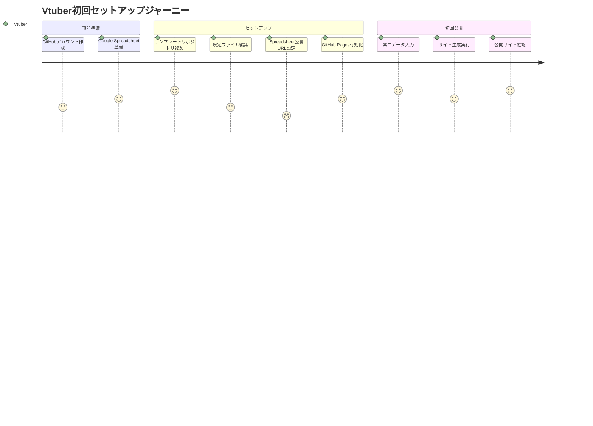
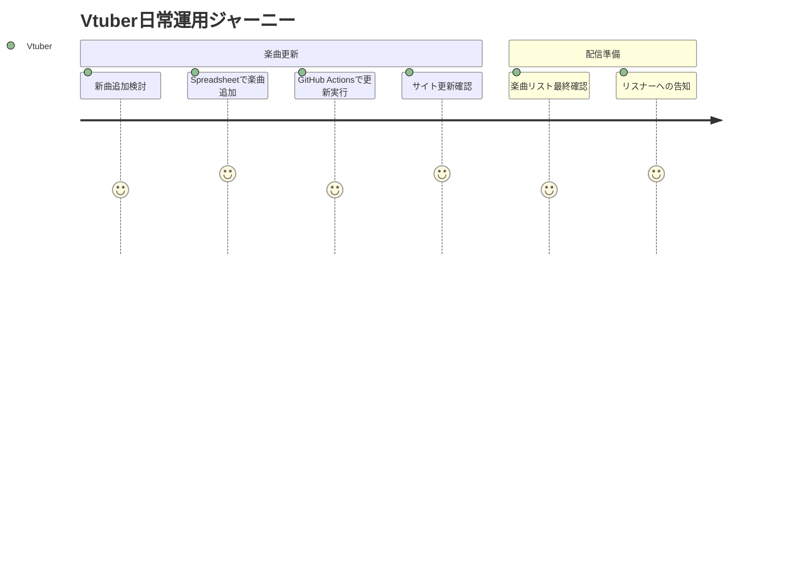
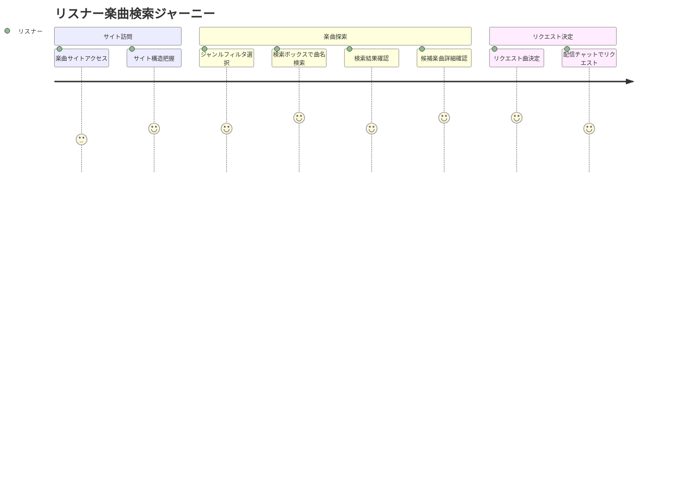
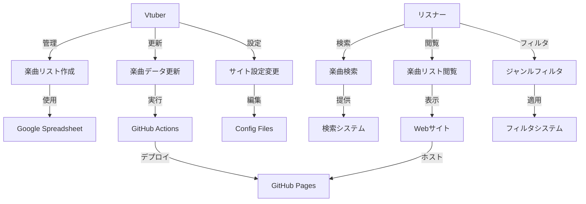

# VtuneList ユーザーストーリー

## 1. 概要

本ドキュメントでは、VtuneListシステムの主要なユーザーストーリーを定義します。ユーザーの視点から具体的な利用シナリオを記述し、開発における優先度と受け入れ基準を明確化します。

## 2. ユーザーペルソナ

### 2.1 プライマリユーザー: Vtuber（配信者）
- **名前**: 桜音かなで
- **属性**: 個人勢Vtuber、歌枠配信メイン
- **技術レベル**: 非エンジニア（基本的なPC操作は可能）
- **目標**: 効率的な歌枠配信運営、リスナーとの良好な関係構築
- **課題**: 楽曲リストの管理が煩雑、リクエスト対応の効率化

### 2.2 セカンダリユーザー: リスナー（視聴者）
- **名前**: 田中聡
- **属性**: Vtuber視聴者、歌枠配信のファン
- **技術レベル**: 一般的なWebユーザー
- **目標**: 好きな曲のリクエスト、新曲発見
- **課題**: 歌える曲の把握が困難、リクエストタイミングの判断

## 3. ユーザーストーリー

### 3.1 Epic 1: 楽曲リスト管理（Vtuber向け）

#### US-001: 初期セットアップ
**As a** Vtuber（桜音かなで）  
**I want to** 簡単に自分の楽曲リストサイトを作成したい  
**So that** 技術知識なしでもプロフェッショナルな楽曲リストを公開できる  

**受け入れ基準:**
- [ ] GitHubアカウントでログインできる
- [ ] テンプレートリポジトリから1クリックで複製できる
- [ ] セットアップ手順が10ステップ以内で完了する
- [ ] 初回セットアップが30分以内で完了する

**優先度:** 最高（Must Have）

---

#### US-002: Spreadsheetでの楽曲管理
**As a** Vtuber  
**I want to** Google Spreadsheetで楽曲を管理したい  
**So that** 使い慣れたツールで効率的に楽曲リストを編集できる  

**受け入れ基準:**
- [ ] Google Spreadsheetで楽曲の追加・編集・削除ができる
- [ ] 目的別にシートを分けて管理できる
- [ ] 曲名、アーティスト、メモを記録できる
- [ ] 日本語入力に完全対応している

**優先度:** 最高（Must Have）

---

#### US-003: サイト更新
**As a** Vtuber  
**I want to** Spreadsheetの変更をWebサイトに簡単に反映したい  
**So that** リスナーに最新の楽曲リストを常に提供できる  

**受け入れ基準:**
- [ ] GitHubでワンクリックで更新を実行できる
- [ ] 更新処理が5分以内に完了する
- [ ] 更新成功・失敗の通知を受け取れる
- [ ] エラー時のトラブルシューティング情報が提供される

**優先度:** 最高（Must Have）

---

### 3.2 Epic 2: 楽曲検索・閲覧（リスナー向け）

#### US-004: 楽曲検索
**As a** リスナー（田中聡）  
**I want to** 曲名やアーティスト名で楽曲を素早く検索したい  
**So that** リクエストしたい曲を効率的に見つけられる  

**受け入れ基準:**
- [ ] 曲名での部分一致検索ができる
- [ ] アーティスト名での検索ができる
- [ ] ひらがな・カタカナ・漢字での検索に対応
- [ ] 検索結果がリアルタイムで表示される（0.02秒以内）
- [ ] あいまい検索（typo許容）に対応

**優先度:** 最高（Must Have）

---

#### US-005: ジャンルフィルタリング
**As a** リスナー  
**I want to** ジャンルで楽曲を絞り込みたい  
**So that** 好みの音楽ジャンルから楽曲を選択できる  

**受け入れ基準:**
- [ ] ジャンル一覧が表示される
- [ ] 複数ジャンルの同時選択ができる
- [ ] フィルタリング結果が即座に表示される
- [ ] フィルタリング状態がURLで保存できる

**優先度:** 高（Should Have）

---

#### US-006: モバイル対応
**As a** リスナー  
**I want to** スマートフォンでも快適に楽曲リストを閲覧したい  
**So that** 配信中にリアルタイムでリクエストを検討できる  

**受け入れ基準:**
- [ ] スマートフォン画面で見やすく表示される
- [ ] タッチ操作で検索・フィルタリングができる
- [ ] 縦画面・横画面の両方に対応
- [ ] ページの読み込みが3秒以内

**優先度:** 高（Should Have）

---

### 3.3 Epic 3: システム管理

#### US-007: エラーハンドリング
**As a** Vtuber  
**I want to** データ更新時のエラーを分かりやすく理解したい  
**So that** 問題を自分で解決できる  

**受け入れ基準:**
- [ ] エラーメッセージが日本語で表示される
- [ ] エラーの原因が具体的に示される
- [ ] 解決方法のガイドが提供される
- [ ] エラー履歴を確認できる

**優先度:** 高（Should Have）

---

#### US-008: データバックアップ
**As a** Vtuber  
**I want to** 楽曲データのバックアップを確保したい  
**So that** データ損失のリスクを回避できる  

**受け入れ基準:**
- [ ] Spreadsheetにデータが保存されている
- [ ] GitHub上にJSONデータが自動バックアップされる
- [ ] バックアップデータから復旧できる

**優先度:** 中（Could Have）

---

## 4. ユーザージャーニー

### 4.1 Vtuber（初回セットアップ）



### 4.2 Vtuber（日常運用）



### 4.3 リスナー（楽曲検索）



## 5. ユースケース図



## 6. 受け入れテスト シナリオ

### 6.1 シナリオ1: 初回セットアップ
```gherkin
Feature: Vtuber初回セットアップ

Scenario: 成功パターン
  Given Vtuberが GitHub アカウントを持っている
  And Google Spreadsheet を準備している
  When テンプレートリポジトリを複製する
  And 設定ファイルを編集する
  And GitHub Pages を有効化する
  Then 楽曲リストサイトが公開される
  And サイトが正常に表示される
```

### 6.2 シナリオ2: 楽曲検索
```gherkin
Feature: リスナー楽曲検索

Scenario: 部分一致検索
  Given 楽曲リストサイトにアクセスしている
  When 検索ボックスに "残酷" と入力する
  Then "残酷な天使のテーゼ" が検索結果に表示される
  And 検索結果が 0.02秒以内に表示される
```

## 7. 優先度マトリクス

| ユーザーストーリー | ビジネス価値 | 技術的複雑度 | 優先度 | 実装順序 |
|------------------|------------|------------|-------|---------|
| US-001: 初期セットアップ | 高 | 中 | Must Have | 1 |
| US-002: Spreadsheet管理 | 高 | 低 | Must Have | 2 |
| US-004: 楽曲検索 | 高 | 中 | Must Have | 3 |
| US-003: サイト更新 | 高 | 高 | Must Have | 4 |
| US-006: モバイル対応 | 中 | 低 | Should Have | 5 |
| US-005: ジャンルフィルタ | 中 | 低 | Should Have | 6 |
| US-007: エラーハンドリング | 中 | 中 | Should Have | 7 |
| US-008: データバックアップ | 低 | 低 | Could Have | 8 |

## 8. 成功指標（KPI）

### 8.1 Vtuber向け指標
- **セットアップ完了率**: 90%以上
- **セットアップ時間**: 平均30分以内
- **楽曲更新頻度**: 月1回以上
- **エラー発生率**: 5%以下

### 8.2 リスナー向け指標
- **サイト滞在時間**: 平均3分以上
- **検索成功率**: 85%以上
- **モバイル利用率**: 60%以上
- **リピート訪問率**: 70%以上

## 9. 今後の拡張ストーリー

### 9.1 Phase 2: YouTube連携
- **US-101**: YouTubeで歌ってみた動画を検索・表示したい
- **US-102**: 歌枠アーカイブの特定時間にジャンプしたい
- **US-103**: サイト内で直接動画を再生したい

### 9.2 Phase 3: コミュニティ機能
- **US-201**: リスナーからのリクエスト投稿を受け付けたい
- **US-202**: 楽曲の歌唱履歴を記録したい
- **US-203**: 楽曲の人気度を可視化したい

これらのユーザーストーリーを基に、具体的な機能仕様と実装計画を策定していきます。