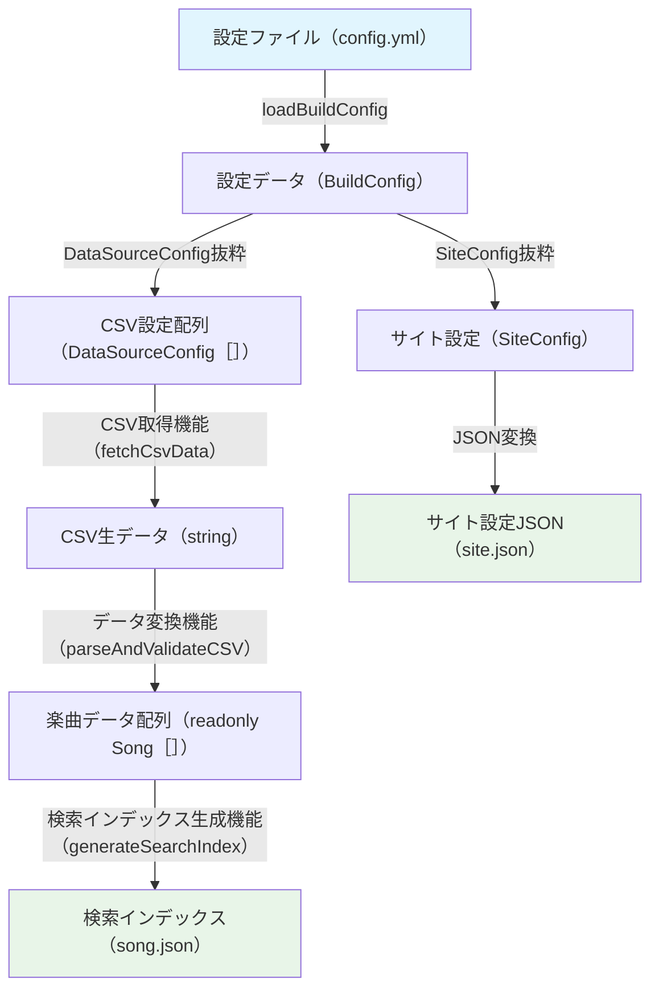
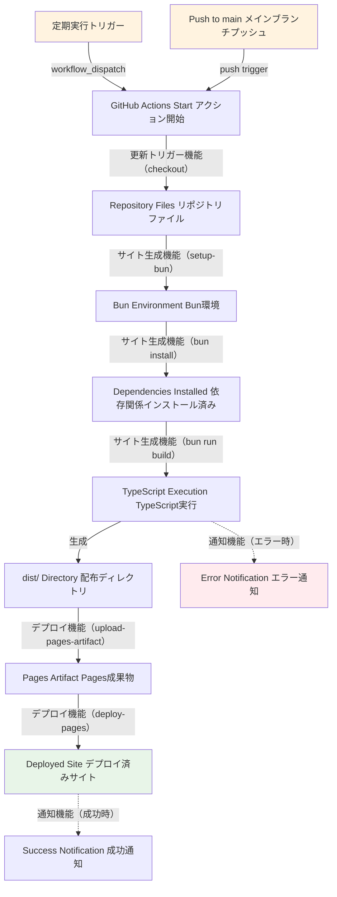

# VtuneList ビルド・デプロイ実装仕様書

## 1. 概要

本ドキュメントは、VtuneListシステムの実装レベルでの詳細仕様を定義します。FUNCTIONAL_SPEC.mdで定義された3つの主要システム（設定管理システム・楽曲データ管理システム・自動サイト更新システム）のTypeScript実装とGitHub Actions自動化の仕様を記述します。

## 2. システム実装構成

### 2.1 TypeScript実装範囲
- **設定管理システム** (Configuration Management System)
- **楽曲データ管理システム** (Song Data Management System)

### 2.2 GitHub Actions実装範囲
- **自動サイト更新システム** (Automatic Site Update System)

## 3. アーキテクチャ原則

### 3.1 関数型設計原則
- **不変性**: 全てのデータは不変（Immutable）
- **純粋関数**: 副作用のないデータ変換関数
- **関数合成**: 小さな関数を組み合わせて複雑な処理を構築
- **明示的な副作用**: I/O操作を明確に分離

### 3.2 エラーハンドリング戦略
```typescript
import { Result, ok, err } from 'neverthrow';

// NeverThrow Result型を全体で使用
type VtuneResult<T> = Result<T, VtuneListError>;
```

## 4. 全体データフロー図

### 4.1 TypeScript実装部分



### 4.2 GitHub Actions自動化部分



## 5. FUNCTIONAL_SPEC.md データフロー対応関係

### 5.1 手動更新フロー対応
FUNCTIONAL_SPEC.md 4.1の横矢印「**手動更新開始 → 手動更新完了**」は、上記4.2図の以下の処理に対応：
- **開始点**: `PUSH[Push to main]` → `ACTIONS_START[GitHub Actions Start]`
- **終了点**: `DEPLOYED_SITE[Deployed Site]` または `ERROR_NOTIFICATION[Error Notification]`

### 5.2 定期実行フロー対応  
FUNCTIONAL_SPEC.md 4.2の横矢印「**定期実行開始 → 定期実行完了**」は、上記4.2図の以下の処理に対応：
- **開始点**: `SCHEDULE[Scheduled Trigger]` → `ACTIONS_START[GitHub Actions Start]`
- **終了点**: `DEPLOYED_SITE[Deployed Site]` または `ERROR_NOTIFICATION[Error Notification]`

### 5.3 ワークフロー手動実行対応
FUNCTIONAL_SPEC.mdの「**ワークフロー手動実行**」は、上記4.2図の以下の処理に対応：
- **実行方法**: `PUSH[Push to main]` → `ACTIONS_START[GitHub Actions Start]`（手動トリガー）
- **処理内容**: GitHub Actionsによる自動ビルド・デプロイ実行

### 5.4 データ変換・バリデーション・song.json生成対応
FUNCTIONAL_SPEC.mdの「**データ変換・バリデーション・song.json生成**」は、上記4.1図の以下の処理に対応：
- **データ変換機能**: `CSV_RAW[string CSV生データ]` → `SONGS_ARRAY[readonly Song[] 楽曲データ配列]`
- **データバリデーション機能**: `parseAndValidateCSV`関数内での入力検証処理
- **song.json生成**: `SEARCH_INDEX[StaticSeekIndex 検索インデックス]` → `SEARCH_JSON_OUTPUT[song.json 楽曲検索JSON]`

## 6. データ型定義

FUNCTIONAL_SPEC.mdとの統一を図った型定義：

```typescript
// 楽曲データ構造（FUNCTIONAL_SPEC.md 6.1準拠）
type Song = {
  readonly title: string;        // 楽曲タイトル
  readonly artist: string;       // アーティスト名
  readonly genre?: string;       // ジャンル（オプション）
  readonly note?: string;        // メモ・備考（オプション）
  readonly updatedAt: string;    // 最終更新日時（ISO 8601）
};

type SongList = {
  readonly songs: readonly Song[];
  readonly metadata: {
    readonly totalCount: number;
    readonly lastUpdated: string;
    readonly version: string;
  };
};

// 設定データ構造（FUNCTIONAL_SPEC.md 6.2準拠）
type SiteConfig = {
  readonly title: string;        // サイトタイトル
  readonly description: string;  // サイト説明
  readonly author: string;       // 著者名
  readonly baseUrl: string;      // ベースURL
};

type DataSourceConfig = {
  readonly csvUrl: string;       // CSV公開URL
  readonly updateInterval: number; // 更新チェック間隔（分）
  readonly timeout: number;      // タイムアウト設定（秒）
};

// config.ymlそのままの型（BuildConfig）
type BuildConfig = {
  readonly site: SiteConfig;
  readonly dataSource: readonly DataSourceConfig[];
};

type SystemConfig = {
  readonly site: SiteConfig;
  readonly dataSource: DataSourceConfig;
};

// 処理結果データ構造（FUNCTIONAL_SPEC.md 6.3準拠）
type ProcessingResult<T> = {
  readonly success: boolean;
  readonly data?: T;
  readonly error?: {
    readonly code: string;
    readonly message: string;
    readonly details?: unknown;
  };
  readonly metadata: {
    readonly timestamp: string;
    readonly processingTime: number;
  };
};

// エラー型定義
enum VtuneListErrorType {
  CONFIG_ERROR = 'CONFIG_ERROR',
  NETWORK_ERROR = 'NETWORK_ERROR',
  PARSE_ERROR = 'PARSE_ERROR',
  VALIDATION_ERROR = 'VALIDATION_ERROR',
  BUILD_ERROR = 'BUILD_ERROR',
  DEPLOY_ERROR = 'DEPLOY_ERROR'
}

type VtuneListError = {
  readonly type: VtuneListErrorType;
  readonly message: string;
  readonly details?: unknown;
  readonly timestamp: string;
};
```

## 7. 設定管理システム実装仕様

### 7.1 サイトメタ情報管理機能 (loadSiteConfig)

```typescript
function loadBuildConfig(): VtuneResult<BuildConfig>
function loadSiteConfig(buildConfig: BuildConfig): VtuneResult<SiteConfig>
```

**処理内容**:
- 環境変数またはデフォルト値からサイト設定を読み込み
- 設定データの妥当性検証（必須フィールド、文字数制限）
- HTMLメタタグ生成用データ準備

**正常処理**:
- 全ての必須設定が存在する場合、SiteConfigオブジェクトを返却

**エラー処理**:
- **必須フィールド不足時**: CONFIG_ERRORを返却、処理停止
- **文字数制限超過時**: 警告ログ出力後、切り詰めて継続

### 7.2 データソース管理機能 (loadDataSourceConfig)

```typescript
function loadDataSourceConfig(buildConfig: BuildConfig): VtuneResult<readonly DataSourceConfig[]>
```

**処理内容**:
- 環境変数からCSV_URLとタイムアウト設定を取得
- URL妥当性検証（形式チェック、HTTPS確認）
- 接続テスト実行（オプション）

**正常処理**:
- 有効なURLと設定が確認できた場合、DataSourceConfigオブジェクトを返却

**エラー処理**:
- **URL無効時**: CONFIG_ERRORを返却、処理停止
- **環境変数不足時**: CONFIG_ERRORを返却、処理停止

## 8. 楽曲データ管理システム実装仕様

### 8.1 CSV取得機能 (fetchCsvData)

```typescript
function fetchCsvData(configs: readonly DataSourceConfig[]): Promise<VtuneResult<string>>
```

**処理内容**:
- 指定URLに対してHTTP GETリクエスト実行
- レスポンス検証（Content-Type、ステータスコード）
- タイムアウトとリトライ機能（指数バックオフ）
- 文字エンコーディング処理

**正常処理**:
- 有効なCSVデータが取得できた場合、CSV文字列を返却

**エラー処理**:
- **HTTP エラー（4xx, 5xx）**: NETWORK_ERRORを返却、エラーコードと詳細をログ出力
- **ネットワークエラー**: 最大3回リトライ後、NETWORK_ERRORを返却
- **タイムアウト**: 設定秒数でタイムアウト、NETWORK_ERRORを返却
- **不正レスポンス**: Content-Type不一致時、PARSE_ERRORを返却

### 8.2 データ検証・変換機能 (parseAndValidateCSV)

```typescript
function parseAndValidateCSV(csvText: string): Promise<VtuneResult<readonly Song[]>>
```

**処理内容**:
- fast-csvライブラリによるCSVパース処理
- ヘッダー行検証、データ行処理
- フィールド妥当性検証（必須項目、データ型、文字数）
- 楽曲データオブジェクト生成

**正常処理**:
- 有効な楽曲データが1件以上存在する場合、Song配列を返却

**エラー処理**:
- **CSV形式不正**: PARSE_ERRORを返却、処理停止
- **必須フィールド不足**: 該当行をスキップ、警告ログ出力、有効データのみ処理継続
- **データ型不一致**: デフォルト値設定、警告ログ出力
- **空ファイル**: VALIDATION_ERRORを返却、処理停止

### 8.3 検索インデックス生成機能 (generateSearchIndex)

```typescript
function generateSearchIndex(songs: readonly Song[]): VtuneResult<StaticSeekIndex>
```

**処理内容**:
- staticseekライブラリによる全文検索インデックス構築
- 検索対象フィールドの抽出・正規化（title, artist, genre, note）
- 重み付け設定適用（title: 2.0, artist: 1.5, genre: 1.0, note: 0.5）
- あいまい検索設定（編集距離: 1）

**正常処理**:
- StaticSeekIndexオブジェクトを生成して返却

**エラー処理**:
- **データ不足**: 最小限のインデックス生成、WARNING通知
- **インデックス生成失敗**: BUILD_ERRORを返却、エラー詳細をログ出力

## 9. zephblaze統合実装

### 9.1 song.json生成 (site/pages/song.json.ts)

```typescript
// zephblazeエントリポイント
export default async function generateSongIndex(): Promise<string>
```

**処理内容**:
- 設定管理システムからDataSourceConfig取得
- 楽曲データ管理システム経由でCSV取得・変換・インデックス生成
- JSON文字列として検索インデックスデータを返却

**正常処理**:
- 検索インデックスJSONを正常生成して返却

**エラー処理**:
- エラー発生時は空のインデックス（エラー情報付き）をJSON文字列で返却

### 9.2 静的サイト生成 (generateStaticSite)

```typescript
function generateStaticSite(
  siteConfig: SiteConfig,
  searchIndex: StaticSeekIndex
): VtuneResult<void>
```

**処理内容**:
- zephblazeによる自動HTML/CSS/JS生成
- サイト設定を用いたメタデータ挿入
- dist/ディレクトリへの静的ファイル出力

**正常処理**:
- dist/ディレクトリに全ての静的ファイルを生成

**エラー処理**:
- **ビルドエラー**: BUILD_ERRORを返却、エラー詳細をログ出力

## 10. 自動サイト更新システム（GitHub Actions）実装仕様

### 10.1 GitHub Actions ワークフロー設定

**トリガー設定**:
- **push**: main ブランチへのプッシュ時（手動更新フロー）
- **schedule**: 定期実行（自動更新フロー）
- **workflow_dispatch**: 手動実行

**主要ステップ**:
```yaml
name: VtuneList Automatic Site Update System
on:
  push:
    branches: [ main ]
  schedule:
    - cron: '0 */6 * * *'  # 6時間ごと
  workflow_dispatch:

jobs:
  build-and-deploy:
    runs-on: ubuntu-latest
    steps:
      - name: Repository checkout
        uses: actions/checkout@v4
      
      - name: Setup Bun environment  
        uses: oven-sh/setup-bun@v1
        
      - name: Install dependencies
        run: bun install
        
      - name: Execute TypeScript build
        run: bun run build
        env:
          CSV_URL: ${{ secrets.CSV_URL }}
          
      - name: Deploy to GitHub Pages
        uses: actions/deploy-pages@v4
        with:
          path: './dist'
```

### 10.2 エラー通知機能

**GitHub Issue自動作成**:
- ビルドエラー発生時、詳細情報とともにIssueを自動生成
- エラーレベルに応じたラベル付与
- 重複Issue防止機能

**通知内容**:
- エラータイプとメッセージ
- 実行環境情報（コミットハッシュ、実行時刻）
- ログ出力への直接リンク

## 11. ライブラリ使用方法

### 11.1 NeverThrow Result型の使用方法

```typescript
import { Result, ok, err, ResultAsync } from 'neverthrow';

// 基本的な使用例
function exampleFunction(): Result<string, Error> {
  if (condition) {
    return ok("成功時の値");
  } else {
    return err(new Error("エラーメッセージ"));
  }
}

// 関数合成の例
function chainedProcessing(): Promise<Result<FinalResult, Error>> {
  return fetchCsvData(config)
    .andThen((csvData) => parseAndValidateCSV(csvData))
    .andThen((songs) => Promise.resolve(generateSearchIndex(songs)))
    .mapErr((error) => new Error(`Processing failed: ${error.message}`));
}
```

### 11.2 fast-csv ライブラリの使用方法

```typescript
import * as csv from 'fast-csv';

// Promiseでラップした使用例
function parseCSVData(csvText: string): Promise<Result<Song[], Error>> {
  return new Promise((resolve) => {
    const songs: Song[] = [];
    
    csv.parseString(csvText, { 
      headers: true,
      ignoreEmpty: true,
      trim: true
    })
    .on('data', (row: any) => {
      songs.push(transformToSong(row));
    })
    .on('end', () => resolve(ok(songs)))
    .on('error', (error) => resolve(err(new Error(`CSV parse error: ${error.message}`))));
  });
}
```

## 12. パフォーマンス要件

FUNCTIONAL_SPEC.md 8章準拠：

### 12.1 レスポンス時間
- **CSV取得**: 30秒以内
- **データ変換**: 楽曲1000件で10秒以内  
- **検索インデックス生成**: 楽曲1000件で20秒以内
- **静的サイト生成**: 5分以内

### 12.2 リソース使用量
- **メモリ使用量**: 1000楽曲で最大100MB
- **ディスク使用量**: 生成ファイル合計で最大50MB

## 13. エラーハンドリング戦略

FUNCTIONAL_SPEC.md 7章準拠のエラー分類と対応方針：

- **CONFIG_ERROR**: 処理即座停止、開発者通知必須
- **NETWORK_ERROR**: リトライ後停止、ログ記録、通知推奨  
- **PARSE_ERROR**: 処理停止、ログ記録、通知推奨
- **BUILD_ERROR**: 処理停止、ログ記録、開発者通知必須
- **DEPLOY_ERROR**: リトライ後停止、ログ記録、開発者通知必須

## 14. セキュリティ実装

### 14.1 秘匿情報管理
- **CSV_URL**: GitHub Secretsによる環境変数管理
- **GITHUB_TOKEN**: GitHub Actions自動提供トークン使用
- **ログ出力**: 機密情報の自動マスキング処理

### 14.2 入力検証
- 全CSV入力データの妥当性検証
- URL形式とHTTPS接続の強制
- XSS対策のためのHTMLエスケープ処理