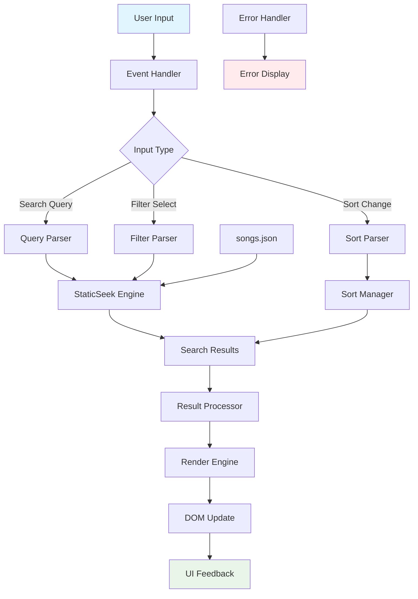
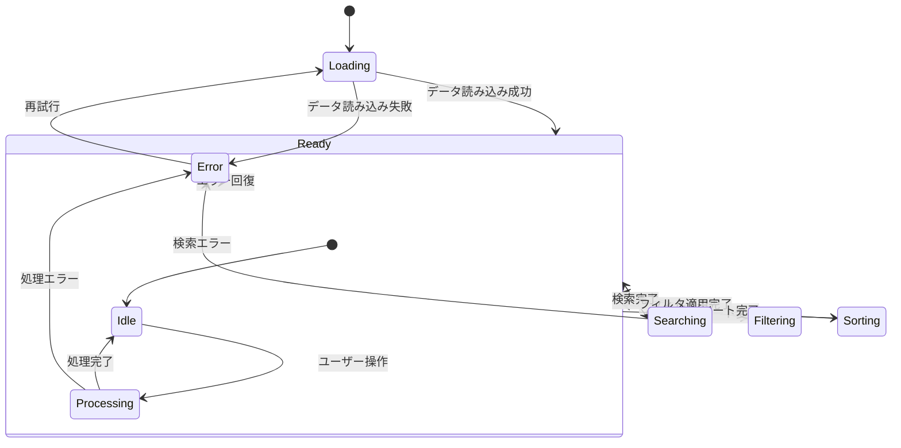
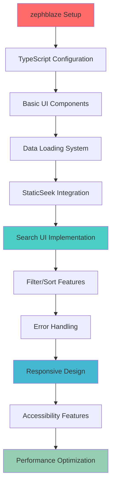

# VtuneList フロントエンド実装仕様書

## 1. 概要

本ドキュメントでは、VtuneListのフロントエンド実装における詳細な設計仕様を定義します。zephblazeベースの静的サイトジェネレーターを使用し、TypeScript + JSXによる型安全な実装を行います。

## 2. アーキテクチャ設計

### 2.1 システム全体図

```
┌─────────────────────────────────────────────────────────────────┐
│                        Browser Environment                       │
├─────────────────────────────────────────────────────────────────┤
│  ┌─────────────────┐  ┌─────────────────┐  ┌─────────────────┐  │
│  │   Presentation  │  │   Application   │  │      Data       │  │
│  │      Layer      │  │      Layer      │  │     Layer       │  │
│  └─────────────────┘  └─────────────────┘  └─────────────────┘  │
│           │                     │                     │          │
│  ┌─────────────────┐  ┌─────────────────┐  ┌─────────────────┐  │
│  │ UI Components   │  │ Search Engine   │  │ JSON Data Store │  │
│  │ • SearchBox     │  │ (staticseek)    │  │ • songs.json    │  │
│  │ • FilterPanel   │  │ • Query Parser  │  │ • search.json   │  │
│  │ • SongList      │  │ • Index Search  │  │                 │  │
│  │ • SortControl   │  │ • Result Rank   │  └─────────────────┘  │
│  │ • ErrorDisplay  │  └─────────────────┘           │          │
│  └─────────────────┘           │                     │          │
│           │                     │                     │          │
│  ┌─────────────────┐  ┌─────────────────┐  ┌─────────────────┐  │
│  │ DOM Handlers    │  │ State Manager   │  │ HTTP Client     │  │
│  │ • Event Bind    │  │ • App State     │  │ • Fetch API     │  │
│  │ • Render Queue  │  │ • UI State      │  │ • JSON Parse    │  │
│  │ • Animation     │  │ • Error State   │  │ • Error Handle  │  │
│  └─────────────────┘  └─────────────────┘  └─────────────────┘  │
└─────────────────────────────────────────────────────────────────┘
```

### 2.2 データフロー図



## 3. 状態管理設計

### 3.1 アプリケーション状態設計

```typescript
// 全体のアプリケーション状態
interface AppState {
  readonly data: DataState;
  readonly ui: UIState;
  readonly search: SearchState;
  readonly error: ErrorState;
}

// データ関連状態
interface DataState {
  readonly songs: readonly Song[];
  readonly searchIndex: StaticSeekIndex | null;
  readonly genres: readonly string[];
  readonly loadState: LoadState;
}

// UI関連状態  
interface UIState {
  readonly view: ViewState;
  readonly layout: LayoutState;
  readonly theme: ThemeState;
}

// 検索関連状態
interface SearchState {
  readonly query: string;
  readonly filters: FilterState;
  readonly sort: SortState;
  readonly results: readonly Song[];
  readonly resultCount: number;
  readonly searchTime: number;
}

// エラー関連状態
interface ErrorState {
  readonly current: VtuneListError | null;
  readonly history: readonly VtuneListError[];
  readonly recoveryState: RecoveryState;
}
```

### 3.2 状態遷移図



### 3.3 状態管理の実装戦略

**基本方針**: 
- **シンプルな状態管理**: Redux/Zustand不使用、直接DOM操作 + TypeScriptクラス
- **イミュータブル更新**: never-throwのResultタイプを活用
- **型安全性**: TypeScriptの厳格モードで実行時エラー防止

**状態更新パターン**:
```typescript
class AppStateManager {
  private state: AppState;
  private listeners: Set<(state: AppState) => void> = new Set();

  setState(updater: (prev: AppState) => Result<AppState, StateError>): void {
    const result = updater(this.state);
    result
      .map(newState => {
        this.state = newState;
        this.notifyListeners();
      })
      .mapErr(error => {
        this.handleStateError(error);
      });
  }

  private notifyListeners(): void {
    this.listeners.forEach(listener => listener(this.state));
  }
}
```

## 4. コンポーネント設計

### 4.1 コンポーネント階層図

```
App
├── Header
│   ├── SiteTitle
│   ├── SearchBox
│   └── ThemeToggle
├── Main
│   ├── FilterPanel
│   │   ├── GenreFilter
│   │   ├── SortControl
│   │   └── ViewToggle
│   ├── ResultSummary
│   └── SongList
│       └── SongCard[]
└── Footer
    ├── Attribution
    └── ErrorBoundary
        └── ErrorDisplay
```

### 4.2 主要コンポーネント仕様

#### SearchBox Component

```typescript
interface SearchBoxProps {
  value: string;
  placeholder: string;
  onSearch: (query: string) => void;
  onClear: () => void;
  loading?: boolean;
  debounceMs?: number; // デフォルト: 300ms
}

interface SearchBoxState {
  inputValue: string;
  debounceTimer: number | null;
  isFocused: boolean;
}
```

**責任範囲**:
- ユーザー入力の受付とデバウンス処理
- 検索クエリのバリデーション
- 入力状態の視覚フィードバック
- キーボードショートカット対応（Ctrl+K等）

#### FilterPanel Component

```typescript
interface FilterPanelProps {
  genres: readonly string[];
  selectedGenres: readonly string[];
  sortField: SortField;
  sortOrder: SortOrder;
  onGenreChange: (genres: readonly string[]) => void;
  onSortChange: (field: SortField, order: SortOrder) => void;
}

interface FilterPanelState {
  isExpanded: boolean; // モバイル用
  genreSearchQuery: string; // ジャンル検索用
}
```

**責任範囲**:
- ジャンル選択UI（チェックボックス）
- ソート設定UI（ドロップダウン + オーダー）
- レスポンシブ対応（モバイル時はアコーディオン）

#### SongList Component

```typescript
interface SongListProps {
  songs: readonly Song[];
  loading: boolean;
  emptyMessage?: string;
  onSongSelect?: (song: Song) => void;
  virtualScroll?: boolean; // 将来の大量データ対応
}

interface SongListState {
  scrollPosition: number;
  visibleRange: { start: number; end: number };
}
```

**責任範囲**:
- 楽曲リストのレンダリング
- 検索ハイライト表示
- 仮想スクロール（大量データ対応）
- アクセシビリティ対応

### 4.3 コンポーネント間通信

**パターン1: Props Down, Events Up**
```typescript
// 親コンポーネント
class App {
  private handleSearch = (query: string): void => {
    this.searchEngine.search(query)
      .map(results => this.updateSearchResults(results))
      .mapErr(error => this.handleSearchError(error));
  }

  render(): JSX.Element {
    return (
      <div>
        <SearchBox onSearch={this.handleSearch} />
        <SongList songs={this.state.search.results} />
      </div>
    );
  }
}
```

**パターン2: Custom Events（DOM Event System）**
```typescript
// カスタムイベント定義
interface SearchEvents {
  'search:query': { query: string };
  'search:clear': {};
  'filter:genre': { genres: string[] };
  'sort:change': { field: SortField; order: SortOrder };
}

// EventTarget拡張によるタイプセーフなイベント
class TypedEventTarget extends EventTarget {
  dispatchTypedEvent<K extends keyof SearchEvents>(
    type: K, 
    detail: SearchEvents[K]
  ): void {
    this.dispatchEvent(new CustomEvent(type, { detail }));
  }
}
```

## 5. 非同期処理設計

### 5.1 非同期処理の分類

**VtuneListにおける非同期処理**:

1. **データ取得処理** (初期化時)
   - songs.jsonの読み込み
   - StaticSeekインデックスの初期化

2. **ユーザー操作処理** (実行時)
   - 検索実行（実際は同期だがUI的に非同期風）
   - デバウンス処理
   - アニメーション処理

### 5.2 非同期状態管理

```typescript
// 非同期操作の状態を表現する型
interface AsyncOperation<T, E> {
  readonly status: 'idle' | 'loading' | 'success' | 'error';
  readonly data: T | null;
  readonly error: E | null;
  readonly startedAt: number | null;
  readonly completedAt: number | null;
}

// 具体的な実装例
interface DataLoadState extends AsyncOperation<{
  songs: Song[];
  searchIndex: StaticSeekIndex;
}, DataLoadError> {}

// 状態遷移の管理
class AsyncStateManager<T, E> {
  constructor(private initialState: AsyncOperation<T, E>) {}

  startOperation(): AsyncOperation<T, E> {
    return {
      ...this.state,
      status: 'loading',
      startedAt: Date.now(),
      error: null
    };
  }

  completeOperation(data: T): AsyncOperation<T, E> {
    return {
      ...this.state,
      status: 'success',
      data,
      completedAt: Date.now()
    };
  }

  failOperation(error: E): AsyncOperation<T, E> {
    return {
      ...this.state,
      status: 'error',
      error,
      completedAt: Date.now()
    };
  }
}
```

### 5.3 Promise/async-awaitパターン

```typescript
// データ取得の非同期処理
class DataLoader {
  async loadSongData(): Promise<Result<LoadedData, DataLoadError>> {
    try {
      // 並列データ取得
      const [songsResponse, configResponse] = await Promise.all([
        fetch('/data/songs.json'),
        fetch('/config.json')
      ]);

      // レスポンス検証
      const songsResult = await this.parseJsonResponse<Song[]>(songsResponse);
      const configResult = await this.parseJsonResponse<SiteConfig>(configResponse);

      // Result型での合成
      return songsResult.andThen(songs =>
        configResult.map(config => ({
          songs,
          config,
          searchIndex: this.createSearchIndex(songs)
        }))
      );

    } catch (error) {
      return err('NETWORK_ERROR');
    }
  }

  private async parseJsonResponse<T>(response: Response): Promise<Result<T, DataLoadError>> {
    if (!response.ok) {
      return err('HTTP_ERROR');
    }

    try {
      const data = await response.json();
      return ok(data as T);
    } catch {
      return err('PARSE_ERROR');
    }
  }
}
```

### 5.4 デバウンス・スロットル処理

```typescript
// デバウンス処理のユーティリティ
class DebounceManager {
  private timers = new Map<string, number>();

  debounce<T extends unknown[]>(
    key: string,
    fn: (...args: T) => void,
    delay: number
  ): (...args: T) => void {
    return (...args: T) => {
      const existingTimer = this.timers.get(key);
      if (existingTimer) {
        clearTimeout(existingTimer);
      }

      const timer = setTimeout(() => {
        fn(...args);
        this.timers.delete(key);
      }, delay);

      this.timers.set(key, timer);
    };
  }

  // 検索用デバウンス
  createSearchDebounce(searchFn: (query: string) => void): (query: string) => void {
    return this.debounce('search', searchFn, 300);
  }
}

// 使用例
class SearchBox {
  private debounce = new DebounceManager();
  private debouncedSearch = this.debounce.createSearchDebounce(
    (query: string) => this.executeSearch(query)
  );

  private handleInputChange = (event: InputEvent): void => {
    const query = (event.target as HTMLInputElement).value;
    this.debouncedSearch(query);
  }
}
```

## 6. エラーハンドリング設計

### 6.1 エラー分類と処理戦略

```typescript
// エラーの分類と処理方法
interface ErrorHandlingStrategy {
  readonly type: ErrorType;
  readonly severity: 'critical' | 'warning' | 'info';
  readonly displayMethod: 'modal' | 'banner' | 'toast' | 'console';
  readonly recovery: 'retry' | 'fallback' | 'ignore';
  readonly userMessage: string;
}

const ERROR_STRATEGIES: Record<ErrorType, ErrorHandlingStrategy> = {
  NETWORK_ERROR: {
    type: 'NETWORK_ERROR',
    severity: 'critical',
    displayMethod: 'modal',
    recovery: 'retry',
    userMessage: '楽曲データの読み込みに失敗しました。ネットワーク接続を確認して再試行してください。'
  },
  SEARCH_ERROR: {
    type: 'SEARCH_ERROR', 
    severity: 'warning',
    displayMethod: 'banner',
    recovery: 'fallback',
    userMessage: '検索機能にエラーが発生しました。全ての楽曲を表示しています。'
  }
  // ... 他のエラータイプ
};
```

### 6.2 Error Boundary実装

```typescript
// React風のError Boundary（DOM版）
class ErrorBoundary {
  private container: HTMLElement;
  private errorDisplay: ErrorDisplay;

  constructor(container: HTMLElement) {
    this.container = container;
    this.setupGlobalErrorHandling();
  }

  private setupGlobalErrorHandling(): void {
    // JavaScript実行時エラーをキャッチ
    window.addEventListener('error', (event) => {
      this.handleError(new VtuneListError(
        'RUNTIME_ERROR',
        'JavaScript実行時エラーが発生しました',
        event.error?.stack || event.message,
        false,
        'warning'
      ));
    });

    // Promise rejection をキャッチ
    window.addEventListener('unhandledrejection', (event) => {
      this.handleError(new VtuneListError(
        'PROMISE_REJECTION',
        '非同期処理でエラーが発生しました',
        String(event.reason),
        true,
        'critical'
      ));
    });
  }

  handleError(error: VtuneListError): void {
    const strategy = ERROR_STRATEGIES[error.type];
    
    switch (strategy.displayMethod) {
      case 'modal':
        this.showErrorModal(error, strategy);
        break;
      case 'banner':
        this.showErrorBanner(error, strategy);
        break;
      case 'toast':
        this.showErrorToast(error, strategy);
        break;
    }

    // エラーログ記録
    this.logError(error);

    // 自動回復試行
    if (strategy.recovery === 'retry') {
      this.scheduleRetry(error);
    }
  }
}
```

### 6.3 ユーザーフレンドリーなエラー表示

```typescript
// エラー表示UI
class ErrorDisplay {
  showRecoverableError(error: VtuneListError): void {
    const errorElement = this.createErrorElement({
      title: 'エラーが発生しました',
      message: error.message,
      actions: [
        { text: '再試行', action: () => this.retryOperation(error) },
        { text: '詳細', action: () => this.showErrorDetails(error) }
      ]
    });

    this.attachToDOM(errorElement);
  }

  showCriticalError(error: VtuneListError): void {
    // ページ全体を置き換える重大エラー表示
    document.body.innerHTML = this.renderCriticalErrorPage(error);
  }

  private createErrorElement(config: ErrorConfig): HTMLElement {
    return (
      <div className="error-container" role="alert">
        <div className="error-icon">⚠️</div>
        <div className="error-content">
          <h3>{config.title}</h3>
          <p>{config.message}</p>
          <div className="error-actions">
            {config.actions.map(action => 
              <button onClick={action.action}>{action.text}</button>
            )}
          </div>
        </div>
      </div>
    ) as HTMLElement;
  }
}
```

## 7. パフォーマンス最適化

### 7.1 初期読み込み最適化

```typescript
// 優先度付きリソース読み込み
class ResourceLoader {
  async loadCriticalResources(): Promise<void> {
    // 高優先度: 基本UI表示に必要
    const criticalPromises = [
      this.loadCSS('/styles/critical.css'),
      this.loadSongData('/data/songs.json')
    ];

    // 中優先度: 機能に必要（パラレル読み込み）
    const featurePromises = [
      this.initializeSearchEngine(),
      this.loadThemeSettings()
    ];

    // 低優先度: UX向上（遅延読み込み）
    const enhancementPromises = [
      this.loadAnalytics(),
      this.loadServiceWorker()
    ];

    // 段階的読み込み
    await Promise.all(criticalPromises);
    this.showBasicUI();

    await Promise.all(featurePromises);
    this.enableInteractiveFeatures();

    // バックグラウンドで実行
    Promise.all(enhancementPromises).catch(console.warn);
  }
}
```

### 7.2 検索パフォーマンス最適化

```typescript
// 検索結果キャッシュ
class SearchCache {
  private cache = new Map<string, CachedSearchResult>();
  private readonly maxCacheSize = 50;

  getCachedResult(query: string): CachedSearchResult | null {
    const normalizedQuery = this.normalizeQuery(query);
    const cached = this.cache.get(normalizedQuery);
    
    if (cached && Date.now() - cached.timestamp < 60000) { // 1分間キャッシュ
      return cached;
    }
    
    return null;
  }

  setCachedResult(query: string, result: SearchResult): void {
    const normalizedQuery = this.normalizeQuery(query);
    
    if (this.cache.size >= this.maxCacheSize) {
      const oldestKey = this.cache.keys().next().value;
      this.cache.delete(oldestKey);
    }
    
    this.cache.set(normalizedQuery, {
      ...result,
      timestamp: Date.now()
    });
  }
}
```

### 7.3 仮想スクロール（将来実装）

```typescript
// 大量データ表示用の仮想スクロール
class VirtualScrollManager {
  private itemHeight = 80; // 1楽曲あたりの高さ
  private containerHeight = 600;
  private visibleCount = Math.ceil(this.containerHeight / this.itemHeight) + 2;

  calculateVisibleRange(scrollTop: number): { start: number; end: number } {
    const start = Math.floor(scrollTop / this.itemHeight);
    const end = Math.min(start + this.visibleCount, this.totalItems);
    
    return { start: Math.max(0, start - 1), end };
  }

  renderVisibleItems(songs: Song[], visibleRange: { start: number; end: number }): JSX.Element[] {
    const visibleSongs = songs.slice(visibleRange.start, visibleRange.end);
    
    return visibleSongs.map((song, index) => (
      <SongCard 
        key={song.id}
        song={song} 
        style={{
          position: 'absolute',
          top: (visibleRange.start + index) * this.itemHeight,
          height: this.itemHeight
        }}
      />
    ));
  }
}
```

## 8. アクセシビリティ対応

### 8.1 WCAG 2.1準拠実装

```typescript
// アクセシビリティ機能
class AccessibilityManager {
  setupKeyboardNavigation(): void {
    // 検索ボックスへのフォーカス (Ctrl+K)
    document.addEventListener('keydown', (event) => {
      if (event.ctrlKey && event.key === 'k') {
        event.preventDefault();
        this.focusSearchBox();
      }
    });

    // リスト内ナビゲーション (Arrow keys)
    this.setupArrowKeyNavigation();
  }

  setupScreenReaderSupport(): void {
    // 動的コンテンツの変更をアナウンス
    const liveRegion = document.createElement('div');
    liveRegion.setAttribute('aria-live', 'polite');
    liveRegion.setAttribute('aria-atomic', 'true');
    liveRegion.className = 'sr-only';
    document.body.appendChild(liveRegion);

    this.liveRegion = liveRegion;
  }

  announceSearchResults(count: number): void {
    if (this.liveRegion) {
      this.liveRegion.textContent = `${count}件の楽曲が見つかりました`;
    }
  }

  setupFocusManagement(): void {
    // フォーカストラップ (モーダル用)
    this.focusTrap = new FocusTrapManager();
    
    // 視覚的フォーカスインジケーター
    document.addEventListener('keydown', (event) => {
      if (event.key === 'Tab') {
        document.body.classList.add('keyboard-navigation');
      }
    });

    document.addEventListener('mousedown', () => {
      document.body.classList.remove('keyboard-navigation');
    });
  }
}
```

### 8.2 セマンティックHTML構造

```typescript
// アクセシビリティを考慮したHTML構造生成
function renderAccessibleSongList(songs: Song[]): JSX.Element {
  return (
    <main role="main" aria-label="楽曲リスト">
      <section aria-labelledby="search-heading">
        <h2 id="search-heading">楽曲検索</h2>
        <SearchBox 
          aria-label="楽曲検索"
          aria-describedby="search-help"
        />
        <div id="search-help">
          楽曲名やアーティスト名で検索できます
        </div>
      </section>
      
      <section aria-labelledby="results-heading">
        <h2 id="results-heading">
          検索結果 
          <span aria-live="polite">{songs.length}件</span>
        </h2>
        
        <ul role="list" aria-label="楽曲一覧">
          {songs.map(song => (
            <li key={song.id} role="listitem">
              <article aria-labelledby={`song-${song.id}`}>
                <h3 id={`song-${song.id}`}>{song.title}</h3>
                <p aria-label="アーティスト名">{song.artist}</p>
                {song.note && (
                  <p aria-label="メモ">{song.note}</p>
                )}
              </article>
            </li>
          ))}
        </ul>
      </section>
    </main>
  );
}
```

## 9. テスト仕様

### 9.1 単体テスト設計

```typescript
// コンポーネントテスト例
describe('SearchBox', () => {
  let searchBox: SearchBox;
  let mockSearchHandler: jest.Mock;

  beforeEach(() => {
    mockSearchHandler = jest.fn();
    searchBox = new SearchBox({
      onSearch: mockSearchHandler,
      debounceMs: 100
    });
  });

  test('デバウンス処理が正常に動作する', async () => {
    // 連続入力
    searchBox.handleInput('a');
    searchBox.handleInput('ab');
    searchBox.handleInput('abc');

    // デバウンス時間前では呼ばれない
    expect(mockSearchHandler).not.toHaveBeenCalled();

    // デバウンス時間後に1回だけ呼ばれる
    await wait(150);
    expect(mockSearchHandler).toHaveBeenCalledTimes(1);
    expect(mockSearchHandler).toHaveBeenCalledWith('abc');
  });

  test('空文字入力時の処理', () => {
    searchBox.handleInput('');
    expect(mockSearchHandler).toHaveBeenCalledWith('');
  });
});

// StaticSeek統合テスト
describe('Search Integration', () => {
  let searchEngine: SearchEngine;
  const testSongs: Song[] = [
    { title: '残酷な天使のテーゼ', artist: '高橋洋子', genre: ['アニソン'] },
    { title: '紅蓮華', artist: 'LiSA', genre: ['アニソン'] }
  ];

  beforeEach(async () => {
    searchEngine = new SearchEngine();
    await searchEngine.initialize(testSongs);
  });

  test('日本語部分一致検索', () => {
    const results = searchEngine.search('残酷');
    expect(results).toHaveLength(1);
    expect(results[0].title).toBe('残酷な天使のテーゼ');
  });

  test('あいまい検索（タイポ許容）', () => {
    const results = searchEngine.search('紅連華'); // "蓮"→"廉"のtypo
    expect(results).toHaveLength(1);
    expect(results[0].title).toBe('紅蓮華');
  });
});
```

### 9.2 E2Eテスト（Playwright）

```typescript
// E2Eテストシナリオ
test('楽曲検索フロー', async ({ page }) => {
  await page.goto('/');
  
  // ページが正常に読み込まれる
  await expect(page.locator('[data-testid=site-title]')).toBeVisible();
  await expect(page.locator('[data-testid=song-list]')).toBeVisible();

  // 検索機能テスト
  const searchBox = page.locator('[data-testid=search-input]');
  await searchBox.fill('残酷');
  
  // デバウンス後に結果が表示される
  await page.waitForTimeout(400);
  const results = page.locator('[data-testid=song-item]');
  await expect(results).toHaveCount(1);
  await expect(results.first()).toContainText('残酷な天使のテーゼ');

  // 検索時間が表示される
  const searchTime = await page.locator('[data-testid=search-time]').textContent();
  expect(parseFloat(searchTime!)).toBeLessThan(0.05);

  // フィルタ機能テスト
  await page.locator('[data-testid=genre-filter-anime]').check();
  await expect(page.locator('[data-testid=song-item]')).toHaveCountGreaterThan(0);

  // 検索クリア
  await page.locator('[data-testid=search-clear]').click();
  await expect(searchBox).toHaveValue('');
});

test('エラーハンドリング', async ({ page }) => {
  // ネットワークエラーをシミュレート
  await page.route('/data/songs.json', route => route.abort());
  await page.goto('/');

  // エラーメッセージが表示される
  await expect(page.locator('[data-testid=error-message]')).toBeVisible();
  await expect(page.locator('[data-testid=retry-button]')).toBeVisible();

  // 再試行ボタンが機能する
  await page.unroute('/data/songs.json');
  await page.route('/data/songs.json', route => route.fulfill({
    status: 200,
    contentType: 'application/json',
    body: JSON.stringify([])
  }));
  
  await page.locator('[data-testid=retry-button]').click();
  await expect(page.locator('[data-testid=error-message]')).not.toBeVisible();
});

test('レスポンシブデザイン', async ({ page }) => {
  // デスクトップ表示
  await page.setViewportSize({ width: 1200, height: 800 });
  await page.goto('/');
  await expect(page.locator('[data-testid=filter-panel]')).toBeVisible();

  // モバイル表示
  await page.setViewportSize({ width: 375, height: 667 });
  await expect(page.locator('[data-testid=filter-toggle]')).toBeVisible();
  
  // フィルターパネルがアコーディオン化される
  await page.locator('[data-testid=filter-toggle]').click();
  await expect(page.locator('[data-testid=filter-panel]')).toBeVisible();
});
```

### 9.3 パフォーマンステスト

```typescript
// パフォーマンス測定テスト
test('検索パフォーマンス', async ({ page }) => {
  await page.goto('/');
  await page.waitForSelector('[data-testid=song-list]');

  // 大量データでの検索性能測定
  const startTime = Date.now();
  await page.fill('[data-testid=search-input]', 'test');
  await page.waitForSelector('[data-testid=search-results]');
  const endTime = Date.now();

  const searchTime = endTime - startTime;
  expect(searchTime).toBeLessThan(100); // 100ms以内

  // メモリリーク検査
  const metrics = await page.evaluate(() => performance.memory);
  expect(metrics.usedJSHeapSize).toBeLessThan(50 * 1024 * 1024); // 50MB以内
});

test('初期読み込みパフォーマンス', async ({ page }) => {
  const startTime = Date.now();
  await page.goto('/');
  await page.waitForSelector('[data-testid=app-ready]');
  const loadTime = Date.now() - startTime;

  expect(loadTime).toBeLessThan(3000); // 3秒以内

  // LighthouseスコアAPI使用（オプション）
  const lighthouse = await page.evaluate(() => {
    return new Promise((resolve) => {
      if ('lighthouse' in window) {
        (window as any).lighthouse.start().then(resolve);
      } else {
        resolve(null);
      }
    });
  });

  if (lighthouse) {
    expect((lighthouse as any).performance).toBeGreaterThan(90);
  }
});
```

## 10. デプロイ・ビルド設計

### 10.1 ビルドプロセス

```typescript
// zephblaze ビルド設定
interface BuildConfig {
  readonly input: string;
  readonly output: string;
  readonly assets: readonly string[];
  readonly optimization: OptimizationConfig;
}

interface OptimizationConfig {
  readonly minify: boolean;
  readonly treeshaking: boolean;
  readonly splitChunks: boolean;
  readonly inlineAssets: number; // bytes threshold
}

const buildConfig: BuildConfig = {
  input: './site',
  output: './dist',
  assets: ['./assets', './public'],
  optimization: {
    minify: true,
    treeshaking: true,
    splitChunks: false, // 静的サイトなので単一ファイル
    inlineAssets: 8192  // 8KB以下はインライン化
  }
};
```

### 10.2 GitHub Actions ワークフロー

```yaml
# .github/workflows/deploy.yml
name: Deploy VtuneList
on:
  workflow_dispatch:
    inputs:
      force_rebuild:
        description: '強制リビルド'
        type: boolean
        default: false

jobs:
  build-and-deploy:
    runs-on: ubuntu-latest
    permissions:
      contents: read
      pages: write
      id-token: write
    
    steps:
      - name: Checkout
        uses: actions/checkout@v4
        
      - name: Setup Bun
        uses: oven-sh/setup-bun@v1
        with:
          bun-version: latest
          
      - name: Install dependencies
        run: bun install --frozen-lockfile
        
      - name: Load configuration
        id: config
        run: |
          if [[ ! -f config.yml ]]; then
            echo "Error: config.yml not found"
            exit 1
          fi
          echo "config-exists=true" >> $GITHUB_OUTPUT
          
      - name: Fetch CSV data
        id: csv-fetch
        run: |
          node scripts/fetch-csv.js
        env:
          CSV_URLS: ${{ steps.config.outputs.csv-urls }}
          
      - name: Validate song data
        run: |
          node scripts/validate-data.js
          
      - name: Generate search index
        run: |
          node scripts/generate-index.js
          
      - name: Build static site
        run: |
          bun run build
        env:
          NODE_ENV: production
          
      - name: Upload Pages artifact
        uses: actions/upload-pages-artifact@v3
        with:
          path: ./dist
          
      - name: Deploy to Pages
        id: deployment
        uses: actions/deploy-pages@v4
        
      - name: Notify success
        if: success()
        run: |
          echo "✅ デプロイ成功: ${{ steps.deployment.outputs.page_url }}"
          
      - name: Notify failure
        if: failure()
        uses: actions/github-script@v7
        with:
          script: |
            github.rest.issues.create({
              owner: context.repo.owner,
              repo: context.repo.repo,
              title: `🚨 サイト更新エラー (${new Date().toISOString()})`,
              body: `
              ## エラー詳細
              
              - **ワークフロー**: ${{ github.workflow }}
              - **実行ID**: ${{ github.run_id }}
              - **エラー段階**: ${{ job.status }}
              
              [ログを確認](${{ github.server_url }}/${{ github.repository }}/actions/runs/${{ github.run_id }})
              
              ## 対処方法
              
              1. config.ymlの設定を確認してください
              2. CSV公開URLが正しいか確認してください  
              3. エラーが継続する場合は手動で再実行してください
              `,
              labels: ['bug', 'auto-generated']
            });
```

### 10.3 品質ゲート

```yaml
  # 品質チェックを追加
  quality-check:
    runs-on: ubuntu-latest
    steps:
      - name: Checkout
        uses: actions/checkout@v4
        
      - name: Setup Bun
        uses: oven-sh/setup-bun@v1
        
      - name: Install dependencies
        run: bun install
        
      - name: Type check
        run: bun run type-check
        
      - name: Lint
        run: bun run lint
        
      - name: Unit tests
        run: bun run test:unit
        
      - name: Build test
        run: bun run build
        
      - name: E2E tests
        run: bun run test:e2e
        env:
          CI: true
          
  # デプロイは品質チェック通過後
  deploy:
    needs: quality-check
    # ... デプロイ処理
```

## 11. 監視・ログ設計

### 11.1 フロントエンドログ設計

```typescript
// ログ管理システム
enum LogLevel {
  DEBUG = 0,
  INFO = 1,
  WARN = 2,
  ERROR = 3
}

interface LogEntry {
  readonly timestamp: string;
  readonly level: LogLevel;
  readonly category: string;
  readonly message: string;
  readonly data?: unknown;
  readonly userAgent?: string;
  readonly url?: string;
}

class Logger {
  private logs: LogEntry[] = [];
  private maxLogs = 100;
  
  constructor(private minLevel: LogLevel = LogLevel.INFO) {}

  debug(category: string, message: string, data?: unknown): void {
    this.log(LogLevel.DEBUG, category, message, data);
  }

  info(category: string, message: string, data?: unknown): void {
    this.log(LogLevel.INFO, category, message, data);
  }

  warn(category: string, message: string, data?: unknown): void {
    this.log(LogLevel.WARN, category, message, data);
  }

  error(category: string, message: string, data?: unknown): void {
    this.log(LogLevel.ERROR, category, message, data);
  }

  private log(level: LogLevel, category: string, message: string, data?: unknown): void {
    if (level < this.minLevel) return;

    const entry: LogEntry = {
      timestamp: new Date().toISOString(),
      level,
      category,
      message,
      data,
      userAgent: navigator.userAgent,
      url: location.href
    };

    this.logs.push(entry);
    this.trimLogs();
    this.outputToConsole(entry);
    this.sendToLocalStorage(entry);
  }

  private outputToConsole(entry: LogEntry): void {
    const message = `[${entry.timestamp}] ${entry.category}: ${entry.message}`;
    
    switch (entry.level) {
      case LogLevel.DEBUG:
        console.debug(message, entry.data);
        break;
      case LogLevel.INFO:
        console.info(message, entry.data);
        break;
      case LogLevel.WARN:
        console.warn(message, entry.data);
        break;
      case LogLevel.ERROR:
        console.error(message, entry.data);
        break;
    }
  }

  // ローカルストレージへのログ保存（デバッグ用）
  private sendToLocalStorage(entry: LogEntry): void {
    try {
      const existingLogs = JSON.parse(localStorage.getItem('vtunelist-logs') || '[]');
      existingLogs.push(entry);
      
      // 最新50件のみ保持
      const recentLogs = existingLogs.slice(-50);
      localStorage.setItem('vtunelist-logs', JSON.stringify(recentLogs));
    } catch {
      // localStorage使用不可時は無視
    }
  }

  // エラー詳細レポート生成（デバッグ用）
  generateErrorReport(): string {
    const errorLogs = this.logs.filter(log => log.level >= LogLevel.ERROR);
    const systemInfo = {
      userAgent: navigator.userAgent,
      timestamp: new Date().toISOString(),
      url: location.href,
      viewport: `${window.innerWidth}x${window.innerHeight}`,
      memory: 'memory' in performance ? (performance as any).memory : null
    };

    return JSON.stringify({
      systemInfo,
      errorLogs: errorLogs.slice(-10), // 最新10件
      recentLogs: this.logs.slice(-20)  // 最新20件
    }, null, 2);
  }
}

// グローバルロガーのセットアップ
const logger = new Logger(
  process.env.NODE_ENV === 'development' ? LogLevel.DEBUG : LogLevel.INFO
);

// 使用例
logger.info('Search', '検索実行', { query: 'test', resultCount: 42, searchTime: 0.015 });
logger.error('DataLoad', 'songs.json読み込み失敗', { url: '/data/songs.json', status: 404 });
```

### 11.2 パフォーマンス監視

```typescript
// パフォーマンス測定
class PerformanceMonitor {
  private metrics: Map<string, PerformanceMetric> = new Map();

  startTiming(name: string): void {
    performance.mark(`${name}-start`);
  }

  endTiming(name: string): number {
    performance.mark(`${name}-end`);
    performance.measure(name, `${name}-start`, `${name}-end`);
    
    const measures = performance.getEntriesByName(name, 'measure');
    const duration = measures[measures.length - 1]?.duration || 0;
    
    this.recordMetric(name, duration);
    logger.debug('Performance', `${name} completed`, { duration });
    
    return duration;
  }

  private recordMetric(name: string, value: number): void {
    const existing = this.metrics.get(name);
    const metric: PerformanceMetric = {
      name,
      count: (existing?.count || 0) + 1,
      total: (existing?.total || 0) + value,
      average: 0,
      min: existing ? Math.min(existing.min, value) : value,
      max: existing ? Math.max(existing.max, value) : value,
      latest: value
    };
    metric.average = metric.total / metric.count;
    
    this.metrics.set(name, metric);
  }

  getMetrics(): Record<string, PerformanceMetric> {
    return Object.fromEntries(this.metrics);
  }

  // Core Web Vitals 監視
  observeWebVitals(): void {
    // First Contentful Paint
    new PerformanceObserver((list) => {
      for (const entry of list.getEntries()) {
        logger.info('WebVitals', 'FCP measured', { 
          value: entry.startTime,
          rating: entry.startTime < 1800 ? 'good' : entry.startTime < 3000 ? 'needs-improvement' : 'poor'
        });
      }
    }).observe({ entryTypes: ['paint'] });

    // Cumulative Layout Shift
    let clsValue = 0;
    new PerformanceObserver((list) => {
      for (const entry of list.getEntries()) {
        if (!(entry as any).hadRecentInput) {
          clsValue += (entry as any).value;
        }
      }
      
      logger.info('WebVitals', 'CLS measured', { 
        value: clsValue,
        rating: clsValue < 0.1 ? 'good' : clsValue < 0.25 ? 'needs-improvement' : 'poor'
      });
    }).observe({ entryTypes: ['layout-shift'] });
  }
}

interface PerformanceMetric {
  name: string;
  count: number;
  total: number;
  average: number;
  min: number;
  max: number;
  latest: number;
}

// グローバルパフォーマンス監視
const perfMonitor = new PerformanceMonitor();
perfMonitor.observeWebVitals();

// 使用例
perfMonitor.startTiming('search-execution');
// ... 検索処理
const searchTime = perfMonitor.endTiming('search-execution');
```

## 12. セキュリティ実装

### 12.1 Content Security Policy

```typescript
// CSP設定（HTML metaタグまたはヘッダーで設定）
const cspDirectives = [
  "default-src 'self'",
  "script-src 'self' 'unsafe-inline'", // JSX inline event handlers用
  "style-src 'self' 'unsafe-inline'",  // CSS-in-JS用
  "img-src 'self' data: https:",       // 画像とdata URLsを許可
  "font-src 'self' https://fonts.gstatic.com",
  "connect-src 'self' https://docs.google.com", // CSV取得用
  "frame-ancestors 'none'",            // Clickjacking防止
  "base-uri 'self'",
  "form-action 'none'"                 // フォーム無効
].join('; ');

// HTML生成時にCSPを追加
function generateSecureHTML(content: string): string {
  return `
    <!DOCTYPE html>
    <html lang="ja">
      <head>
        <meta charset="utf-8">
        <meta name="viewport" content="width=device-width, initial-scale=1">
        <meta http-equiv="Content-Security-Policy" content="${cspDirectives}">
        <meta http-equiv="X-Content-Type-Options" content="nosniff">
        <meta http-equiv="X-Frame-Options" content="DENY">
        <meta name="referrer" content="strict-origin-when-cross-origin">
        ${content}
      </head>
    </html>
  `;
}
```

### 12.2 入力サニタイゼーション

```typescript
// XSS防止のための入力サニタイゼーション
class SecurityUtils {
  // HTML特殊文字のエスケープ
  static escapeHtml(text: string): string {
    const div = document.createElement('div');
    div.textContent = text;
    return div.innerHTML;
  }

  // URL検証
  static isValidUrl(url: string): boolean {
    try {
      const parsed = new URL(url);
      return ['http:', 'https:'].includes(parsed.protocol);
    } catch {
      return false;
    }
  }

  // 検索クエリサニタイゼーション（staticseekが内部で処理するが念のため）
  static sanitizeSearchQuery(query: string): string {
    return query
      .trim()
      .slice(0, 100) // 最大100文字
      .replace(/[<>]/g, ''); // HTMLタグ文字削除
  }

  // ファイル名の安全性チェック（将来の拡張用）
  static isValidFilename(filename: string): boolean {
    const dangerousChars = /[<>:"/\\|?*\x00-\x1f]/;
    return !dangerousChars.test(filename) && filename.length <= 255;
  }
}

// 使用例
class SearchBox {
  private handleInput = (event: InputEvent): void => {
    const rawQuery = (event.target as HTMLInputElement).value;
    const safeQuery = SecurityUtils.sanitizeSearchQuery(rawQuery);
    
    if (safeQuery !== rawQuery) {
      logger.warn('Security', 'Search query sanitized', { raw: rawQuery, safe: safeQuery });
      (event.target as HTMLInputElement).value = safeQuery;
    }
    
    this.executeSearch(safeQuery);
  };
}
```

## 13. 国際化対応（将来実装）

### 13.1 多言語対応設計

```typescript
// i18n基本設計（将来実装用）
interface I18nMessages {
  'search.placeholder': string;
  'search.results': string;
  'filter.all': string;
  'error.network': string;
  'error.retry': string;
  // ... 他のキー
}

type SupportedLanguage = 'ja' | 'en';

class I18nManager {
  private currentLanguage: SupportedLanguage = 'ja';
  private messages: Record<SupportedLanguage, I18nMessages>;

  constructor(messages: Record<SupportedLanguage, I18nMessages>) {
    this.messages = messages;
  }

  t(key: keyof I18nMessages, params?: Record<string, string>): string {
    let message = this.messages[this.currentLanguage][key];
    
    if (params) {
      Object.entries(params).forEach(([param, value]) => {
        message = message.replace(`{{${param}}}`, value);
      });
    }
    
    return message;
  }

  setLanguage(language: SupportedLanguage): void {
    this.currentLanguage = language;
    document.documentElement.lang = language;
    this.updateUI();
  }

  private updateUI(): void {
    // DOM内のi18n属性を持つ要素を更新
    document.querySelectorAll('[data-i18n]').forEach(element => {
      const key = element.getAttribute('data-i18n') as keyof I18nMessages;
      element.textContent = this.t(key);
    });
  }
}

// 使用例
const i18n = new I18nManager({
  ja: {
    'search.placeholder': '楽曲名やアーティスト名で検索',
    'search.results': '{{count}}件の楽曲が見つかりました',
    'filter.all': 'すべて',
    'error.network': 'ネットワークエラーが発生しました',
    'error.retry': '再試行'
  },
  en: {
    'search.placeholder': 'Search by song title or artist',
    'search.results': '{{count}} songs found',
    'filter.all': 'All',
    'error.network': 'Network error occurred',
    'error.retry': 'Retry'
  }
});
```

## 14. まとめ

### 14.1 実装優先度

| 機能カテゴリ | 優先度 | 実装順序 | 実装時期 |
|-------------|-------|---------|---------|
| **基本UI構造** | 最高 | 1 | Phase 1 |
| **データ取得・表示** | 最高 | 2 | Phase 1 |
| **検索機能** | 最高 | 3 | Phase 1 |
| **エラーハンドリング** | 高 | 4 | Phase 1 |
| **フィルタ・ソート** | 高 | 5 | Phase 1 |
| **レスポンシブ対応** | 高 | 6 | Phase 1 |
| **アクセシビリティ** | 中 | 7 | Phase 2 |
| **パフォーマンス最適化** | 中 | 8 | Phase 2 |
| **監視・ログ** | 低 | 9 | Phase 2 |
| **国際化対応** | 低 | 10 | Phase 3 |

### 14.2 技術的依存関係



### 14.3 品質保証チェックリスト

**機能チェック**:
- [ ] 楽曲データが正常に読み込まれる
- [ ] 検索機能が日本語・あいまい検索に対応
- [ ] フィルタ機能が複数選択に対応
- [ ] ソート機能が正常に動作
- [ ] エラー時に適切なメッセージが表示

**パフォーマンスチェック**:
- [ ] 初期読み込み3秒以内
- [ ] 検索レスポンス0.02秒以内
- [ ] 1000件データで性能劣化なし
- [ ] メモリリークなし

**ユーザビリティチェック**:
- [ ] モバイルで快適に操作可能
- [ ] キーボード操作対応
- [ ] スクリーンリーダー対応
- [ ] 直感的なUI設計

**セキュリティチェック**:
- [ ] XSS対策実装済み
- [ ] CSP設定適用済み
- [ ] 入力サニタイゼーション実装済み
- [ ] セキュアヘッダー設定済み

